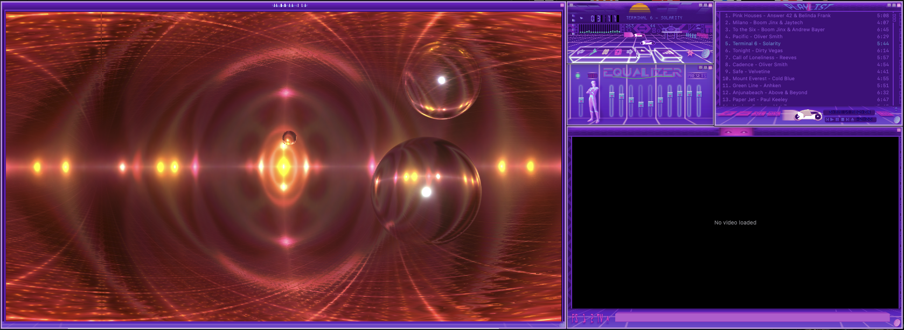

# MacAmp

A pixel-perfect, native macOS audio player that brings the classic desktop audio player experience to modern Apple Silicon Macs with full skin compatibility.



## Overview

MacAmp is a SwiftUI-based audio player for macOS that recreates the iconic desktop audio player interface with modern enhancements. Built specifically for **macOS Sequoia (15.0+)** and **macOS Tahoe (26.0+)**, it leverages the latest SwiftUI features while maintaining pixel-perfect fidelity to classic skins.

### Key Features

- 🎨 **Full Skin Support** - Load and switch between classic `.wsz` skins with VISCOLOR.TXT gradients
- 🎵 **Native Audio Engine** - Built on AVFoundation for optimal macOS performance
- 🎚️ **10-Band Equalizer** - Professional audio control with 17 built-in presets
- 📊 **Spectrum Analyzer & Oscilloscope** - Click visualizer to cycle through 3 modes: Spectrum (frequency bars), Oscilloscope (waveform), or None
- ⌨️ **Keyboard Navigation** - Navigate playlist menus with arrow keys (↑↓) and Escape
- ♿ **VoiceOver Ready** - Accessible menu navigation for screen reader users
- 📋 **M3U/M3U8 Playlists** - Load playlists with local files and internet radio streams
- 📻 **Internet Radio** - Stream HTTP/HTTPS radio with live metadata
- 📂 **Playlist Menus** - Sprite-based popup menus for ADD, REM, MISC, and LIST OPTS with hover states
- ✨ **Multi-Select** - Shift+Click to select multiple tracks, Command+A to select all, with CROP and remove operations
- 📝 **Native Text Rendering** - Playlist tracks use real text with PLEDIT.txt colors and Unicode support (not bitmap fonts)
- 🎛️ **Advanced Controls** - Volume, balance, position seeking, shuffle, and three-state repeat (Off/All/One)
- 🔄 **Three-State Repeat** - Winamp 5 Modern fidelity with Off/All/One modes and "1" badge indicator (Ctrl+R to cycle)
- 🪟 **Multi-Window Interface** - Main player, equalizer, playlist, and video windows with shade modes
- 📐 **Resizable Playlist** - Drag to resize in 25×29px segments with dynamic tiling and scroll slider
- 📊 **Playlist Visualizer** - Mini spectrum analyzer in playlist when main window is shaded
- 📺 **Video Playback** - Native video support (MP4, MOV, M4V) with V button or Ctrl+V
- 🎬 **Video Window** - Skinnable video window with VIDEO.bmp chrome or classic fallback
- 🔲 **Full Video Resize** - Drag any size with 25×29px quantized segments (1x/2x preset buttons)
- 🎚️ **Unified Video Controls** - Volume slider, seek bar, and time display work for both audio and video
- 📝 **Video Metadata Ticker** - Auto-scrolling display showing filename, codec, and resolution
- 🎨 **Butterchurn Visualizations** - 245 Milkdrop 2 presets with 60 FPS audio-reactive WebGL rendering
- 🌀 **Preset Controls** - Cycle (Space/Backspace), randomize (R), auto-cycle intervals, context menu selection
- 🖼️ **Milkdrop Window Resize** - Drag corner with 25×29px segment grid and dynamic titlebar expansion
- 🖼️ **5-Window Architecture** - Main, Equalizer, Playlist, VIDEO, and Milkdrop windows with unified focus tracking
- 🧲 **Magnetic Docking** - Windows snap together and stay docked when resizing (Ctrl+D compatible)
- 🔍 **Double-Size Mode** - Toggle 200% scaling with D button or Ctrl+D for better visibility on high-res displays
- 📌 **Always On Top** - Keep window floating above others with A button or Ctrl+A (Classic Winamp feature)
- ⚙️ **Options Menu** - Quick access to player settings via O button or Ctrl+O with time display toggle (Ctrl+T)
- ℹ️ **Track Information** - View detailed track/stream metadata with I button or Ctrl+I
- 🎯 **Native macOS Integration** - Borderless windows with custom title bars
- ⚡ **Modern SwiftUI** - Utilizes WindowDragGesture and latest macOS APIs
- 🔄 **Dynamic Skin Switching** - Hot-swap skins without restart
- 📦 **Distribution Ready** - Developer ID signed builds for /Applications installation
- 🚀 **Swift 6 Architecture** - Modern, performant, future-proof codebase

## Requirements

- **macOS Sequoia 15.0+** or **macOS Tahoe 26.0+**
- **Apple Silicon** (M1/M2/M3/M4) or Intel Mac
- **Xcode 26.0+** (for building from source)

## Download

### Latest Release: v1.0.1 (January 2026)

[](https://github.com/hfyeomans/MacAmp/releases/tag/v1.0.1)

**[Download MacAmp-v1.0.1.dmg](https://github.com/hfyeomans/MacAmp/releases/tag/v1.0.1)** (3.4 MB)

| Property | Value |
|----------|-------|
| Version | 1.0.1 |
| Build | 3 |
| Signed | Developer ID Application |
| Notarized | Yes (Apple approved) |
| Architecture | Universal (arm64 + x86_64) |

**Installation:**
1. Download the DMG file
2. Open the DMG
3. Drag MacAmp to Applications folder
4. Launch from Applications (no Gatekeeper warnings)

**What's New in v1.0.1:**
- **Resizable Milkdrop Window** - Drag corner to resize with 25×29px quantized segments
- **Butterchurn Visualization Packs** - 245 authentic Milkdrop 2 presets with WebGL rendering
- **Dynamic Titlebar Expansion** - Gold filler tiles expand symmetrically as window grows
- **Preset Controls** - Space/Backspace navigation, R for randomize, C for auto-cycle
- **Context Menu** - Right-click for direct preset selection from full library

See [Release Notes](https://github.com/hfyeomans/MacAmp/releases/tag/v1.0.1) for full changelog.

## Installation

### Building from Source

```bash
# Clone the repository
git clone https://github.com/yourusername/MacAmp.git
cd MacAmp

# Build with Swift Package Manager
swift build

# Run the app
.build/debug/MacAmpApp
```

### Running in Xcode

```bash
# Open in Xcode
open Package.swift

# Press Cmd+R to build and run
```

## Usage

### Basic Playback

1. **Load Audio/Video Files** - Click the eject button (supports MP3, FLAC, WAV, MP4, MOV, M4V) or drag files to the window
2. **Play/Pause/Stop** - Use transport controls
3. **Seek** - Drag the position slider to jump to any point in the track
4. **Volume** - Adjust with the vertical volume slider
5. **Balance** - Pan left/right with the balance slider

### Equalizer

1. **Open Equalizer** - Press `Cmd+Shift+E` or click the EQ button
2. **Adjust Bands** - Drag any of the 10 frequency sliders or preamp
3. **Load Presets** - Click "Presets" → "Load" → Choose from 17 built-in presets
4. **Save Settings** - Click "Presets" → "Save" to create custom presets
5. **Toggle EQ** - Click "ON" button to enable/disable equalization

Available presets: Classical, Club, Dance, Full Bass, Full Bass & Treble, Full Treble, Laptop Speakers/Headphones, Large Hall, Live, Party, Pop, Reggae, Rock, Ska, Soft, Soft Rock, Techno

### Playlist

1. **Open Playlist** - Press `Cmd+Shift+P` or click the PL button
2. **Add Files** - Click ADD button for local files or M3U/M3U8 playlists
3. **Add Radio Stream** - Click ADD → ADD URL, paste URL (e.g., `http://ice1.somafm.com/groovesalad-256-mp3`)
4. **Play** - Double-click any item (file or stream)
5. **Navigate** - Next/Previous work across local files and streams
6. **Shuffle/Repeat** - Work with mixed playlists

**Note:** Streams show "Connecting..." during buffering, then live metadata. No EQ/visualizer for streams (AVPlayer limitation).

### Playlist Window Resize

1. **Resize Window** - Drag the bottom-right corner to resize
2. **Quantized Sizing** - Snaps to 25×29px segments (Winamp standard)
3. **Size Range** - Minimum 275×116px, maximum 2000×900px
4. **Dynamic Layout:**
   - **Top Bar** - Title tiles expand/contract with width
   - **Side Borders** - Vertical tiles adjust to height
   - **Bottom Bar** - Three sections: LEFT (menus) + CENTER (tiles) + RIGHT (controls)
5. **Scroll Slider** - Gold thumb appears on right border, drag to scroll playlist
6. **Persistence** - Window size remembered across app restarts

**Size Examples:**
| Segments | Pixels | Visible Tracks |
|----------|--------|----------------|
| [0,0] | 275×116 | 4 tracks |
| [0,4] | 275×232 | 13 tracks (default) |
| [4,8] | 375×348 | 21 tracks |

### Playlist Mini Visualizer

The playlist window includes a mini spectrum analyzer that activates when the main window is **shaded**:

1. **Activation** - Shade the main window (click titlebar shade button or press `Cmd+Option+1`)
2. **Requirements:**
   - Playlist window must be **wide enough** (≥350px, or 3+ width segments)
   - Main window must be in **shade mode** (minimized to 14px bar)
3. **Behavior:**
   - Same 19-bar spectrum analyzer as main window
   - Located in bottom-right visualizer background area
   - Deactivates automatically when main window unshades
4. **Usage** - Allows visualizer viewing while main window is minimized

### Skins

1. **Switch Skins** - Use keyboard shortcuts:
   - `Cmd+Shift+1` - Classic Winamp
   - `Cmd+Shift+2` - Internet Archive
   - `Cmd+Shift+3` - Tron Vaporwave
   - `Cmd+Shift+4` - Winamp3 Classified
2. **Import Skins** - Place `.wsz` files in `~/Library/Application Support/MacAmp/Skins/`
3. **Supported Formats** - Standard ZIP-based skin files

### Options Menu (O Button)

1. **Open Menu** - Click the "O" button in the clutter bar OR press **Ctrl+O**
2. **Menu Contents:**
   - **Time Display** - Toggle between elapsed and remaining time (also **Ctrl+T**)
   - **Double Size** - Toggle 200% scaling (also **Ctrl+D** or D button)
   - **Repeat** - Enable/disable repeat mode (also **Ctrl+R**)
   - **Shuffle** - Enable/disable shuffle mode (also **Ctrl+S**)
3. **Visual Feedback** - Active settings show checkmarks (✓)
4. **Keyboard Shortcut** - **Ctrl+O** (open menu), **Ctrl+T** (toggle time)

### Double-Size Mode

1. **Toggle Size** - Click the "D" button in the clutter bar, use the "O" button menu, OR press **Ctrl+D**
2. **Normal Mode** - Windows at 100% size (275×116 for main/EQ)
3. **Doubled Mode** - Windows at 200% size (550×232 for main/EQ)
4. **Behavior** - All 3 windows (main, EQ, playlist) scale together
5. **Persistence** - Last size remembered across app restarts
6. **Animation** - Smooth 0.2-second transition
7. **Keyboard Shortcut** - **Ctrl+D** (also in Windows menu and O button menu)

### Always On Top

1. **Toggle Float** - Click the "A" button in the clutter bar, use the "O" button menu, OR press **Ctrl+A**
2. **Normal Mode** - Window at normal level (can be covered by other apps)
3. **Float Mode** - Window stays above all other windows
4. **Persistence** - Last setting remembered across app restarts
5. **Keyboard Shortcut** - **Ctrl+A** (also in Windows menu and O button menu)

### Track Information (I Button)

1. **Open Dialog** - Click the "I" button in the clutter bar OR press **Ctrl+I**
2. **Displays:**
   - Track title and artist (for local files)
   - Duration in MM:SS format
   - Technical details: bitrate, sample rate, channels
   - Stream name (for radio streams)
   - Graceful fallbacks for limited metadata
3. **Visual Feedback** - I button highlighted while dialog is open
4. **Dismissal** - Click "Close" button, press Esc, or click outside
5. **Keyboard Shortcut** - **Ctrl+I**

### Repeat Modes (Winamp 5 Modern Fidelity)

MacAmp supports three repeat modes matching Winamp 5 Modern skins (Modern, Bento, cPro):

1. **Repeat: Off** - Stops at playlist end (button unlit)
2. **Repeat: All** - Loops entire playlist (button lit)
3. **Repeat: One** - Repeats current track (button lit + white "1" badge)

**Usage:**
- **Click repeat button** to cycle: Off → All → One → Off
- **Keyboard shortcut:** Press **Ctrl+R** to cycle through modes
- **Options menu:** Press **Ctrl+O**, select specific mode directly
- **Visual indicator:** White "1" badge appears on button when in Repeat One mode

**Behavior:**
- **Off mode:** Next button stops at last track, Previous stops at first
- **All mode:** Next wraps to first track, Previous wraps to last
- **One mode:** Next/Previous skip to adjacent track, track ending naturally restarts same track
- **Persistence:** Mode remembered across app restarts

**Winamp Compatibility:**
- Badge uses same overlay technique as Winamp 5 plugins for classic skins
- Shadow ensures legibility across all skin colors (dark and light buttons)
- Scales automatically with double-size mode (Ctrl+D)

### Visualizer Modes

1. **Click to Cycle** - Click the spectrum analyzer window to cycle through visualization modes
2. **3 Modes Available:**
   - **Spectrum Analyzer** - Frequency bars showing bass to treble (default)
   - **Oscilloscope** - Waveform display showing actual audio wave shape
   - **None** - Visualizer off (blank)
3. **Persistence** - Last mode remembered across app restarts
4. **How to Use:**
   - Play music
   - Click the black analyzer window (shows bars or waveform)
   - Cycles: Spectrum → Oscilloscope → None → Spectrum...

**Visualization Modes:**
- **Spectrum:** 19 vertical bars dancing to different frequencies - bass on left, treble on right
- **Oscilloscope:** Connected waveform line showing the actual audio wave (very active and dynamic!)
- **None:** Blank display (visualizer off)

**Clutter Bar Buttons** (vertical strip, left side):
- **O** - Options menu with time display, double-size, repeat, shuffle toggles (functional) ✅
- **A** - Always On Top window floating (functional) ✅
- **I** - Track Information metadata dialog (functional) ✅
- **D** - Double Size 100%/200% scaling (functional) ✅
- **V** - Video Window toggle (functional) ✅

### Video Window

1. **Open Video Window** - Click the "V" button in the clutter bar OR press **Ctrl+V**
2. **Load Video** - Drop MP4, MOV, or M4V files into playlist and double-click
3. **Resize** - Drag bottom-right corner (25×29px quantized segments) or use 1x/2x buttons
4. **Controls** - Volume slider, seek bar, and time display work just like audio
5. **Metadata** - Bottom bar shows scrolling filename, codec, and resolution
6. **Skinnable** - VIDEO.bmp chrome (from skin) or classic fallback
7. **Docking** - Video window snaps to other MacAmp windows magnetically
8. **Persistence** - Window position and size remembered across restarts

### Milkdrop Visualizations

1. **Open Window** - Press **Ctrl+K** to toggle Milkdrop window
2. **Visualizations** - 245 authentic Milkdrop 2 presets with WebGL rendering at 60 FPS
3. **Preset Navigation:**
   - **Space** - Next preset (or random if randomize enabled)
   - **Backspace** - Previous preset (history-based)
   - **R** - Toggle randomize mode
   - **C** - Toggle auto-cycle (configurable intervals: 5s/10s/15s/30s/60s)
   - **T** - Toggle track title display (configurable intervals or manual)
4. **Context Menu** - Right-click for:
   - Current preset display
   - Direct preset selection (up to 100 shown in menu)
   - Cycle and randomize toggles
   - Track title interval configuration
5. **Window Features:**
   - GEN.bmp skinnable chrome with MILKDROP HD letterforms
   - Active/Inactive titlebar states (focus tracking)
   - Drag-to-resize with 25×29px segments (minimum 275×116, default 275×232)
   - Dynamic titlebar expansion using gold filler tiles
   - Magnetic docking to other MacAmp windows and screen edges
   - Size and position persisted across app restarts
6. **Audio Sync** - Real-time FFT audio from AVAudioEngine (30 FPS data → 60 FPS WebGL rendering)

## Architecture

MacAmp uses a three-layer architecture inspired by modern frontend frameworks:

### Mechanism Layer
- **AudioPlayer** - AVAudioEngine-based playback with EQ
- **PlaylistManager** - Track queue and playback order
- **SkinManager** - Dynamic skin loading and hot-swapping

### Bridge Layer
- **SpriteResolver** - Semantic sprite resolution for cross-skin compatibility
- **ViewModels** - State management and business logic
- **DockingController** - Multi-window coordination

### Presentation Layer
- **SwiftUI Views** - Pixel-perfect component rendering
- **SimpleSpriteImage** - Sprite sheet rendering with semantic support
- **Custom Sliders** - Frame-based sprite animation

For detailed architecture documentation, see [`docs/ARCHITECTURE_REVELATION.md`](docs/ARCHITECTURE_REVELATION.md).

## Project Structure

MacAmp follows a three-layer architecture inspired by modern frontend frameworks:

```
MacAmpApp/
├── Audio/                              # 🔧 MECHANISM LAYER - Audio Engine & Playback
│   ├── AudioPlayer.swift                   # AVAudioEngine-based local file playback with 10-band EQ
│   ├── PlaybackCoordinator.swift           # ⭐ NEW: Orchestrates dual backend (local + streaming)
│   └── StreamPlayer.swift                  # ⭐ NEW: AVPlayer-based HTTP/HTTPS radio streaming
│
├── Models/                             # 🔧 MECHANISM LAYER - Data Models & Parsers
│   ├── AppSettings.swift                   # @Observable app settings and preferences
│   ├── EQF.swift                           # EQ preset file format codec
│   ├── EQPreset.swift                      # Equalizer preset data model
│   ├── ImageSlicing.swift                  # Sprite sheet extraction utilities
│   ├── M3UEntry.swift                      # M3U playlist entry structure
│   ├── M3UParser.swift                     # M3U/M3U8 playlist parser (local + remote)
│   ├── PLEditParser.swift                  # PLEDIT.txt color parser
│   ├── PlaylistWindowSizeState.swift       # ⭐ NEW: Playlist resize state with computed properties
│   ├── RadioStation.swift                  # ⭐ NEW: Radio station model
│   ├── RadioStationLibrary.swift           # ⭐ NEW: Favorite stations persistence
│   ├── Size2D.swift                        # ⭐ NEW: Quantized 25×29px resize segments
│   ├── VideoWindowSizeState.swift          # ⭐ NEW: Video window resize state management
│   ├── WindowFocusState.swift              # ⭐ NEW: Window focus tracking for active/inactive
│   ├── Skin.swift                          # Skin package data model
│   ├── SkinSprites.swift                   # Sprite name definitions and mappings (VIDEO + GEN letters)
│   ├── SnapUtils.swift                     # Window snapping utilities
│   ├── SpritePositions.swift               # Sprite coordinate definitions
│   ├── SpriteResolver.swift                # Semantic sprite resolution (cross-skin compat)
│   ├── VisColorParser.swift                # VISCOLOR.TXT gradient parser
│   └── WindowSpec.swift                    # Window dimension specifications
│
├── ViewModels/                         # 🌉 BRIDGE LAYER - State Management & Controllers
│   ├── DockingController.swift             # Multi-window coordination and positioning
│   ├── SkinManager.swift                   # Dynamic skin loading, hot-swapping, sprite caching
│   └── WindowCoordinator.swift             # ⭐ NEW: 5-window lifecycle, AppKit bridge, focus tracking
│
├── Windows/                            # 🖼️ NSWindowController Layer (AppKit)
│   ├── WinampMainWindowController.swift    # Main window controller with @MainActor
│   ├── WinampEqualizerWindowController.swift   # EQ window controller
│   ├── WinampPlaylistWindowController.swift    # Playlist window controller
│   ├── WinampVideoWindowController.swift   # ⭐ NEW: Video window controller
│   └── WinampMilkdropWindowController.swift    # ⭐ NEW: Milkdrop window controller
│
├── Views/                              # 🎨 PRESENTATION LAYER - SwiftUI Windows & Views
│   ├── Components/                         # Reusable UI Components
│   │   ├── PlaylistBitmapText.swift            # Bitmap font rendering for playlist
│   │   ├── PlaylistMenuDelegate.swift          # ⭐ NEW: NSMenuDelegate for keyboard navigation
│   │   ├── PlaylistScrollSlider.swift          # ⭐ NEW: Gold thumb scroll slider with proportional sizing
│   │   ├── PlaylistTimeText.swift              # Time display component
│   │   ├── SimpleSpriteImage.swift             # Pixel-perfect sprite rendering (.interpolation(.none))
│   │   ├── SpriteMenuItem.swift                # Sprite-based popup menu items
│   │   └── WinampVolumeSlider.swift            # Frame-based volume/balance sliders
│   ├── Windows/                            # ⭐ NEW: Window Chrome Components
│   │   ├── VideoWindowChromeView.swift         # VIDEO.bmp chrome with dynamic sizing
│   │   ├── MilkdropWindowChromeView.swift      # GEN.bmp chrome with two-piece letters
│   │   ├── AVPlayerViewRepresentable.swift     # NSViewRepresentable for AVPlayerView
│   │   └── WindowResizePreviewOverlay.swift    # AppKit overlay for resize preview
│   ├── EqGraphView.swift                   # Equalizer frequency response graph
│   ├── PreferencesView.swift               # Settings and preferences window
│   ├── PresetsButton.swift                 # EQ preset selector button
│   ├── SkinnedBanner.swift                 # Scrolling banner text component
│   ├── SkinnedText.swift                   # Skinned text rendering
│   ├── UnifiedDockView.swift               # Multi-window container with double-size scaling
│   ├── VisualizerOptions.swift             # Visualizer mode switching UI
│   ├── VisualizerView.swift                # Spectrum analyzer & oscilloscope rendering
│   ├── WinampEqualizerWindow.swift         # 10-band equalizer window
│   ├── WinampMainWindow.swift              # Main player window with transport controls
│   ├── WinampPlaylistWindow.swift          # Playlist window with sprite-based menus
│   ├── WinampVideoWindow.swift             # ⭐ NEW: Video window with AVPlayer
│   └── WinampMilkdropWindow.swift          # ⭐ NEW: Milkdrop visualization window
│
├── Utilities/                          # 🔧 Helper Functions & Extensions
│   ├── WindowAccessor.swift                # NSWindow access from SwiftUI
│   ├── WindowFocusDelegate.swift           # ⭐ NEW: NSWindowDelegate for focus tracking
│   └── WindowSnapManager.swift             # Magnetic window snapping
│
├── AppCommands.swift                   # Global keyboard shortcuts and menu commands
├── MacAmpApp.swift                     # App entry point & dependency injection
├── SkinsCommands.swift                 # Skin switching command handlers
└── Skins/                              # Bundled .wsz skin packages

Tests/
└── MacAmpTests/
    ├── AppSettingsTests.swift              # Settings persistence tests
    ├── AudioPlayerStateTests.swift         # Audio engine state tests
    ├── DockingControllerTests.swift        # Window coordination tests
    ├── EQCodecTests.swift                  # EQF file format tests
    ├── PlaylistNavigationTests.swift       # Playlist operation tests
    ├── SkinManagerTests.swift              # Skin loading tests
    └── SpriteResolverTests.swift           # Sprite resolution tests

docs/                                   # Technical Documentation
tasks/                                  # Development Planning & Context
Package.swift                           # Swift Package Manager Configuration
```

### Recent Architectural Changes (2025)

**Playlist Window Resize** (December 2025):
- Added **PlaylistWindowSizeState** for observable resize state with computed layout properties
- Added **PlaylistScrollSlider** component with proportional thumb sizing
- Added **isMainWindowShaded** to AppSettings for cross-window shade state observation
- Three-section bottom bar: LEFT (125px) + CENTER (dynamic tiles) + RIGHT (150px)
- Segment-based resize (25×29px) with UserDefaults persistence
- Mini visualizer integration when main window is shaded

**Video & Milkdrop Windows** (November 2025):
- Added **WindowCoordinator** for 5-window lifecycle management and AppKit/SwiftUI bridge
- Added **WindowFocusState** and **WindowFocusDelegate** for active/inactive titlebar tracking
- Added **Size2D** and **VideoWindowSizeState** for quantized 25×29px resize segments
- Added **VIDEO.bmp sprites** (24 sprites) to SkinSprites.swift for skinnable chrome
- Added **GEN.bmp two-piece letter sprites** (32 sprites) for Milkdrop titlebar
- Video playback integrated into AudioPlayer (MediaType routing, AVPlayer backend)
- Task { @MainActor in } pattern for timer/observer closures (Thread Sanitizer clean)
- Observable visibility state for window toggle coordination

**Internet Radio Support** (October 2025):
- Added **PlaybackCoordinator** to orchestrate dual audio backends
- Added **StreamPlayer** for AVPlayer-based HTTP/HTTPS streaming
- Added **RadioStation** and **RadioStationLibrary** for station management
- Streams integrated into playlist alongside local files (Winamp parity)

**Swift 6 Modernization** (October 2025):
- Migrated to **@Observable** framework (replaced ObservableObject)
- Added **PlaylistMenuDelegate** for keyboard navigation in sprite menus
- Applied pixel-perfect rendering (`.interpolation(.none)`) throughout
- Full Swift 6 strict concurrency compliance

**UI Enhancements** (October-November 2025):
- **Video & Milkdrop Windows** (v0.8.9): 5-window architecture complete
  - **V Button**: Video Window toggle (Ctrl+V) - 1x/2x resize, metadata ticker
  - **Milkdrop Window**: GEN.bmp chrome foundation (Ctrl+K)
- **Clutter Bar Controls** (v0.7.8): 5 of 5 buttons functional
  - **O Button**: Options menu with time display toggle, settings access (Ctrl+O, Ctrl+T)
  - **A Button**: Always On Top window floating (Ctrl+A)
  - **I Button**: Track Information metadata dialog (Ctrl+I)
  - **D Button**: Double-Size 100%/200% scaling (Ctrl+D)
  - **V Button**: Video Window toggle (Ctrl+V)
- **Visualizer Modes**: Clickable visualizer cycles through Spectrum → Oscilloscope → None
- **Keyboard Navigation**: Arrow keys and VoiceOver support in all menus

For detailed architecture documentation, see [`docs/*]

## Keyboard Shortcuts

### Global Controls

| Shortcut | Action |
|----------|--------|
| `Space` | Play/Pause |
| `Cmd+O` | Open file |
| `Ctrl+O` | Open options menu (time, double-size, repeat, shuffle) |
| `Ctrl+T` | Toggle time display (elapsed ⇄ remaining) |
| `Ctrl+R` | Cycle repeat mode (Off → All → One) |
| `Ctrl+I` | Show track information dialog |
| `Ctrl+D` | Toggle double-size mode (100% ↔ 200%) |
| `Ctrl+A` | Toggle always on top (float window) |
| `Ctrl+V` | Toggle video window |
| `Ctrl+K` | Toggle Milkdrop window |
| `Cmd+Shift+E` | Toggle equalizer window |
| `Cmd+Shift+P` | Toggle playlist window |
| `Cmd+Shift+1` | Switch to Classic Winamp skin |
| `Cmd+Shift+2` | Switch to Internet Archive skin |
| `Cmd+Shift+3` | Switch to Tron Vaporwave skin |
| `Cmd+Shift+4` | Switch to Winamp3 Classified skin |
| `←` / `→` | Previous/Next track |
| `↑` / `↓` | Volume up/down |

### Menu Navigation & Accelerators

| Key | Action |
|-----|--------|
| `↑` / `↓` | Navigate menu items (when menu is open) |
| `Escape` | Close menu |
| `Click` | Activate highlighted item |
| `Ctrl+D` | Double-size (when Options menu is open) |
| `Ctrl+R` | Repeat (when Options menu is open) |
| `Ctrl+S` | Shuffle (when Options menu is open) |

**Accessible Menus:** ADD, REM, MISC, and LIST buttons now support full keyboard navigation with VoiceOver announcements.

## Supported Formats

### Audio Files
- MP3 (all bitrates)
- FLAC (lossless)
- AAC/M4A
- WAV/AIFF
- Apple Lossless (ALAC)

### Playlists & Streams
- M3U/M3U8 (local files + radio URLs)
- HTTP/HTTPS streams (SHOUTcast, Icecast, HLS)

### Skins
- WSZ (ZIP-based Winamp skins)
- VISCOLOR.TXT gradients
- Classic skin sprite sheets

## Technical Highlights

### Modern macOS Features

- **WindowDragGesture** - Native SwiftUI window dragging (macOS 15+)
- **Borderless Windows** - Custom title bars with system chrome removed
- **SwiftUI Materials** - Glass effects and backdrop blur (optional)
- **AVAudioEngine** - Real-time audio processing and EQ
- **Structured Concurrency** - Modern Swift async/await patterns

### Skin Compatibility

MacAmp implements comprehensive skin support:

- **Sprite Resolution** - Handles `DIGIT_0` vs `DIGIT_0_EX` variants automatically
- **Dynamic Loading** - Loads sprite sheets from ZIP archives on-the-fly
- **Fallback System** - Generates placeholder sprites for missing elements
- **2D Grid Rendering** - Supports complex sprite layouts (e.g., EQMAIN.BMP 14×2 grid)
- **Mirrored Gradients** - Balance slider with proper center snapping

See [`docs/SpriteResolver-Architecture.md`](docs/SpriteResolver-Architecture.md) for implementation details.

### Performance Optimizations

- **Sprite Sheet Caching** - Pre-processed backgrounds for instant rendering
- **SwiftUI Body Minimization** - Prevents ghost images from re-evaluation
- **Progress Timer Optimization** - 100ms update interval balances CPU vs. smoothness
- **Conditional Logging** - `#if DEBUG` wraps all debug output

## Recent Updates

### v1.0.1 (January 2026) - Resizable Milkdrop + Butterchurn Packs 🎆

**The first stable release of MacAmp!**

**Major Features:**
- ✅ **Resizable Milkdrop Window** - Full drag-to-resize support
  - Drag bottom-right corner with 25×29px quantized segments
  - Dynamic titlebar expansion using gold filler tiles (symmetrical left/right)
  - 7-section titlebar: LEFT_CAP + LEFT_GOLD(n) + LEFT_END + CENTER(3) + RIGHT_END + RIGHT_GOLD(n) + RIGHT_CAP
  - MILKDROP HD letterforms stay centered at all widths
  - Size persistence via UserDefaults
- ✅ **Butterchurn Visualization Packs** - 245 authentic Milkdrop 2 presets
  - WebGL rendering at 60 FPS with real-time FFT audio from AVAudioEngine
  - Preset navigation: Space/Backspace (next/previous), R (randomize), C (auto-cycle)
  - Context menu with direct preset selection from full library
  - Configurable auto-cycle intervals (5s/10s/15s/30s/60s)
  - Track title overlay with T key toggle

**Technical:**
- MilkdropWindowSizeState @Observable with computed layout properties
- ButterchurnBridge.setSize() syncs WebGL canvas on resize
- Oracle Grade A validation (Thread Sanitizer clean)
- Developer ID signed and Apple notarized

### v0.10.0 (January 2026) - Butterchurn Visualizations + Milkdrop Resize 🌀

**Major Features:**
- ✅ **Butterchurn Visualization Engine** - Authentic Milkdrop 2 experience via WebGL
  - 245 presets from Milkdrop 2 library (expanded from original 29)
  - 60 FPS audio-reactive rendering with real-time FFT from AVAudioEngine
  - WKUserScript injection for butterchurn.min.js and butterchurnPresets.min.js
  - 30 FPS Swift→JS audio bridge via callAsyncJavaScript
- ✅ **Preset Management System** - Full Winamp-compatible preset controls
  - Space/Backspace for next/previous (history-based navigation)
  - R key toggles randomize mode
  - C key toggles auto-cycle with intervals (5s/10s/15s/30s/60s)
  - T key shows track title overlay with configurable intervals
  - Context menu with direct preset selection (up to 100 shown)
  - Preset state persisted across restarts (randomize, cycle, intervals)
- ✅ **Milkdrop Window Resize** - Segment-based resizing with dynamic chrome
  - Drag bottom-right corner with 25×29px quantized segments
  - Minimum 275×116px (Size2D[0,0]), default 275×232px (Size2D[0,4])
  - Dynamic titlebar expansion using gold filler tiles (symmetrical left/right)
  - 7-section titlebar layout: LEFT_CAP + LEFT_GOLD(n) + LEFT_END + CENTER(3) + RIGHT_END + RIGHT_GOLD(n) + RIGHT_CAP
  - MilkdropWindowSizeState @Observable with computed layout properties
  - Size persistence via UserDefaults
  - Butterchurn canvas sync on resize via ButterchurnBridge.setSize()
- ✅ **GEN.bmp Sprite System** - Complete chrome implementation
  - MILKDROP HD titlebar letterforms (two-piece sprites for selected/inactive)
  - Active/Inactive titlebar states with WindowFocusState integration
  - Two-piece bottom bar sprites (TOP + BOTTOM for pixel-perfect alignment)

**Technical Achievements:**
- WKWebView integration with WebGL for visualization
- ButterchurnPresetManager with cycling, randomization, and history
- NSMenu closure-to-selector bridge pattern (MilkdropMenuTarget)
- AppKit resize preview overlay during drag (WindowResizePreviewOverlay)
- Oracle Grade A validation (5 critical bug fixes for thread safety and lifecycle)
- Thread Sanitizer clean (Timer cleanup, @MainActor annotations)

**Implementation:**
- PR #36: Milkdrop window foundation with GEN.bmp chrome
- PR #37: Butterchurn.js visualization integration
- PR #38: Preset library expansion (29→245 presets)
- PR #39: Window resize with dynamic titlebar system
- 7 phases completed (WKUserScript injection → preset management → window resize)

### v0.9.1 (December 2025) - Playlist Window Resize + Mini Visualizer 📐

**Major Features:**
- ✅ **Playlist Window Resize** - Full resize support matching Winamp behavior
  - Drag bottom-right corner to resize in 25×29px quantized segments
  - Minimum 275×116px, maximum 2000×900px
  - Three-section bottom bar: LEFT (125px menus) + CENTER (dynamic tiles) + RIGHT (150px controls)
  - Dynamic top bar and side border tiling
  - Size persisted to UserDefaults across restarts
- ✅ **Playlist Scroll Slider** - Functional gold thumb scroll control
  - Proportional thumb size based on visible/total tracks
  - Drag to scroll through playlist
  - Located in right border area
- ✅ **Playlist Mini Visualizer** - Spectrum analyzer in playlist window
  - Activates when main window is **shaded** (minimized to 14px bar)
  - Requires playlist width ≥350px (3+ width segments)
  - Same 19-bar spectrum analyzer as main window
  - Renders 76px, clips to 72px (Winamp historical accuracy)

**Main Window Shade Mode:**
- ✅ Shade state migrated to AppSettings (observable, persisted)
- ✅ Cross-window observation enables playlist visualizer activation
- ✅ Menu command "Shade/Unshade Main" fixed

**Bug Fixes:**
- Fixed shade mode buttons not clickable (ZStack alignment)
- Fixed NSWindow constraints (allow dynamic playlist width)
- Fixed persisted size restoration on launch
- Fixed PLAYLIST_BOTTOM_RIGHT_CORNER sprite width (154→150px)

**Architecture:**
- PlaylistWindowSizeState.swift - Observable state with computed layout properties
- PlaylistScrollSlider.swift - Reusable scroll slider component
- Three-layer pattern maintained (Mechanism→Bridge→Presentation)
- Oracle Grade: A- (Architecture Aligned)

**Documentation:**
- Added docs/PLAYLIST_WINDOW.md (860 lines)
- Added Part 22 to BUILDING_RETRO_MACOS_APPS_SKILL.md

### v0.8.9 (November 2025) - Video & Milkdrop Windows 🎬

**Major Features:**
- ✅ **Video Window** - Native video playback with VIDEO.bmp skinned chrome
  - Full resize with 25×29px quantized segments
  - 1x/2x size preset buttons
  - VIDEO.bmp sprite rendering (24 sprites) or classic fallback
  - Metadata ticker with auto-scrolling (filename, codec, resolution)
- ✅ **Milkdrop Window Foundation** - GEN.bmp two-piece letter sprites
  - "MILKDROP" titlebar with 32 letter sprites
  - Active/Inactive focus states
  - Foundation ready for future visualization
- ✅ **Unified Video Controls** (Part 21)
  - Volume slider synced to video playback
  - Seek bar works for video files (drag to any position)
  - Time display shows video elapsed/remaining
  - Clean switch between audio↔video playback

**5-Window Architecture:**
- Main, Equalizer, Playlist, VIDEO, and Milkdrop windows
- Magnetic docking for all windows
- Window focus tracking with active/inactive sprites
- Position persistence via WindowFrameStore
- V button (Ctrl+V) and K button (Ctrl+K) shortcuts

**Technical Achievements:**
- Size2D quantized resize model (25×29px segments)
- WindowCoordinator bridge methods for AppKit/SwiftUI separation
- Observable visibility state (isEQWindowVisible, isPlaylistWindowVisible)
- Task { @MainActor in } pattern for timer/observer closures
- playbackProgress stored pattern (must assign all three values)
- currentSeekID invalidation before playerNode.stop()
- AppKit preview overlay for resize visualization
- Oracle Grade A validation (all architectural concerns resolved)

**Bug Fixes:**
- Fixed invisible window phantom affecting cluster docking
- Fixed titlebar gap with proper tile calculation (ceil())
- Fixed EQ/PL button state sync with WindowCoordinator
- Fixed timer closures using proper MainActor hopping

**Status:** Video window 100% complete, Milkdrop foundation complete (visualization deferred)

### v0.7.8 (November 2025) - Clutter Bar O & I Buttons 🎉

**New Features:**
- ✅ **O Button (Options Menu)** - Context menu with player settings
  - Time display toggle (elapsed ⇄ remaining)
  - Quick access to double-size, repeat, and shuffle modes
  - Keyboard shortcuts: Ctrl+O (menu), Ctrl+T (time toggle)
- ✅ **I Button (Track Information)** - Metadata dialog
  - Shows track title, artist, duration
  - Technical details: bitrate, sample rate, channels
  - Stream-aware with graceful fallbacks
  - Keyboard shortcut: Ctrl+I
- ✅ **Time Display Enhancement** - Click time display to toggle, persists across restarts

**Bug Fixes:**
- Fixed NSMenu lifecycle issue preventing repeated menu usage
- Fixed minus sign vertical centering in time display
- Fixed keyboard shortcuts working with any window focused
- Fixed SwiftUI state mutation warning

**Clutter Bar Status:** 5 of 5 buttons functional (O, A, I, D, V)

### v0.2.0 (October 2025) - Swift 6 Modernization 🎉

**Major Architecture Upgrade:**
- ✅ **Swift 6.0** - Upgraded to latest Swift with strict concurrency
- ✅ **Modern State Management** - Migrated to @Observable framework for better performance
- ✅ **Keyboard Accessibility** - Full keyboard navigation in playlist menus
- ✅ **Zero Warnings** - Clean build with strict concurrency checking
- ✅ **Improved Performance** - 10-20% fewer UI updates with fine-grained observation
- ✅ **VoiceOver Support** - Screen reader accessibility for menus

**User-Visible Improvements:**
- Smoother UI updates and animations
- Arrow key navigation in all playlist menus (ADD, REM, MISC, LIST)
- Better stability and responsiveness
- Pixel-perfect sprite rendering throughout
- Improved audio playback reliability

**Technical Excellence:**
- Zero concurrency errors with Swift 6 strict mode
- Production-ready codebase
- Modern SwiftUI patterns throughout

---

## Development

### Completed Phases

**Swift Modernization (Oct 2025):**
- ✅ **Phase 1:** Pixel-perfect sprite rendering (PR #23)
- ✅ **Phase 2:** @Observable migration + Swift 6 (PR #24)
- ✅ **Phase 3:** NSMenuDelegate keyboard navigation (PR #25)

**Earlier Phases:**
- ✅ SpriteResolver architecture
- ✅ Time display with semantic sprites
- ✅ All slider implementations (volume, balance, position, EQ)
- ✅ EQ with 17 presets
- ✅ Shuffle and repeat modes
- ✅ Borderless windows with WindowDragGesture
- ✅ Playlist menu system with multi-select
- ✅ Native text rendering

### Known Limitations

**Not Yet Implemented:**
- Settings persistence (volume resets on restart)
- Playlist scrolling (for large playlists)
- Enter key menu activation (arrow keys + click work)

See [`tasks/swift-modernization-recommendations/unimplemented-features.md`](tasks/swift-modernization-recommendations/unimplemented-features.md) for details.

### Contributing

We welcome contributions! Areas that need work:

1. **Additional Skin Support** - Test with more classic skins
2. **Playlist Persistence** - Save/restore playlists
3. **Media Key Support** - Respond to keyboard media keys
4. **Dock Integration** - Show controls in macOS dock
5. **File Format Support** - Add OGG Vorbis, Opus support

## Documentation

- **Architecture:** [`docs/ARCHITECTURE_REVELATION.md`](docs/ARCHITECTURE_REVELATION.md)
- **Sprite System:** [`docs/SpriteResolver-Architecture.md`](docs/SpriteResolver-Architecture.md)
- **Skin Format:** [`docs/winamp-skins-lessons.md`](docs/winamp-skins-lessons.md)
- **Playlist Window:** [`docs/PLAYLIST_WINDOW.md`](docs/PLAYLIST_WINDOW.md)
- **Phase 4 Plan:** [`tasks/phase4-polish-and-bugfixes/plan.md`](tasks/phase4-polish-and-bugfixes/plan.md)

## Credits

### Inspiration

MacAmp draws inspiration from the classic desktop audio player that defined a generation of music listening, adapted for modern macOS with native SwiftUI.

### Dependencies

- [ZIPFoundation](https://github.com/weichsel/ZIPFoundation) - ZIP archive handling
- AVFoundation - Native macOS audio engine
- SwiftUI - Modern declarative UI framework

### References

- **Webamp** - Browser-based implementation for architectural patterns
- **Skin Format Specification** - Classic skin `.wsz` format documentation
- **Apple SwiftUI Documentation** - macOS 15+ features

## License

[Add your license here]

## Support

For issues, questions, or feature requests:
- Open an issue on GitHub
- Check [`docs/`](docs/) for technical documentation
- Review [`tasks/`](tasks/) for development planning

---

**Built with ❤️ for macOS**

*MacAmp - Bringing classic audio player vibes to modern Apple Silicon.*
