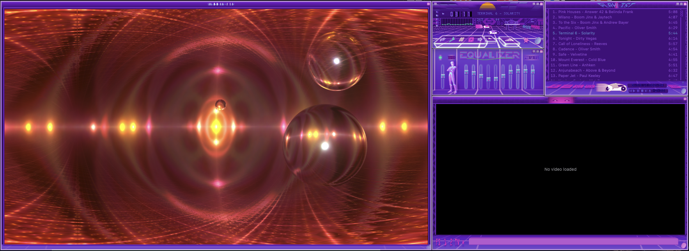

# MacAmp


A pixel-perfect, native macOS audio player that brings the classic desktop audio player experience to modern Apple Silicon Macs with full skin compatibility.



## Overview

MacAmp is a SwiftUI-based audio player for macOS that recreates the iconic desktop audio player interface with modern enhancements. Built specifically for **macOS Sequoia (15.0+)** and **macOS Tahoe (26.0+)**, it leverages the latest SwiftUI features while maintaining pixel-perfect fidelity to classic skins.

### Key Features

- 🎨 **Full Skin Support** - Load and switch between classic `.wsz` skins with full sprite and color support
- 🎵 **Native Audio Engine** - Built on AVFoundation for optimal macOS performance
- 🎚️ **10-Band Equalizer** - Professional audio control with 17 built-in presets
- 📊 **Spectrum Analyzer & Oscilloscope** - Click visualizer to cycle through 3 modes: Spectrum (frequency bars), Oscilloscope (waveform), or None
- ⌨️ **Keyboard Navigation** - Navigate playlist menus with arrow keys (↑↓) and Escape
- ♿ **VoiceOver Ready** - Accessible menu navigation for screen reader users
- 📋 **M3U/M3U8 Playlists** - Load playlists with local files and internet radio streams
- 📻 **Internet Radio** - Stream HTTP/HTTPS radio with live metadata, EQ, and visualizer support
- 🔄 **Auto-Reconnect** - Streams automatically reconnect after network interruptions with clear error messages
- 📂 **Playlist Menus** - Sprite-based popup menus for ADD, REM, MISC, and LIST OPTS with hover states
- ✨ **Multi-Select** - Shift+Click to select multiple tracks, Command+A to select all, with CROP and remove operations
- 📝 **Native Text Rendering** - Playlist tracks use real text with PLEDIT.txt colors and Unicode support (not bitmap fonts)
- 🎛️ **Advanced Controls** - Volume, balance, position seeking, shuffle, and three-state repeat (Off/All/One)
- 🔄 **Three-State Repeat** - Winamp 5 Modern fidelity with Off/All/One modes and "1" badge indicator (Ctrl+R to cycle)
- 🪟 **Multi-Window Interface** - Main player, equalizer, playlist, and video windows with shade modes
- 📐 **Resizable Playlist** - Drag to resize in 25×29px segments with dynamic tiling and scroll slider
- 📊 **Playlist Visualizer** - Mini spectrum analyzer in playlist when main window is shaded
- 📺 **Video Playback** - Native video support (MP4, MOV, M4V) with V button or Ctrl+V
- 🎬 **Video Window** - Skinnable video window with VIDEO.bmp chrome or classic fallback
- 🔲 **Full Video Resize** - Drag any size with 25×29px quantized segments (1x/2x preset buttons)
- 🎚️ **Unified Video Controls** - Volume slider, seek bar, and time display work for both audio and video
- 📝 **Video Metadata Ticker** - Auto-scrolling display showing filename, codec, and resolution
- 🎨 **Butterchurn Visualizations** - 245 Milkdrop 2 presets with 60 FPS audio-reactive WebGL rendering
- 🌀 **Preset Controls** - Cycle (Space/Backspace), randomize (R), auto-cycle intervals, context menu selection
- 🖼️ **Milkdrop Window Resize** - Drag corner with 25×29px segment grid and dynamic titlebar expansion
- 🖼️ **5-Window Architecture** - Main, Equalizer, Playlist, VIDEO, and Milkdrop windows with unified focus tracking
- 🧲 **Magnetic Docking** - Windows snap together and stay docked when resizing (Ctrl+D compatible)
- 🔍 **Double-Size Mode** - Toggle 200% scaling with D button or Ctrl+D for better visibility on high-res displays
- 📌 **Always On Top** - Keep window floating above others with A button or Ctrl+A (Classic Winamp feature)
- ⚙️ **Options Menu** - Quick access to player settings via O button or Ctrl+O with time display toggle (Ctrl+T)
- ℹ️ **Track Information** - View detailed track/stream metadata with I button or Ctrl+I
- 🎯 **Native macOS Integration** - Borderless windows with custom title bars
- ⚡ **Modern SwiftUI** - Utilizes WindowDragGesture and latest macOS APIs
- 🔄 **Dynamic Skin Switching** - Hot-swap skins without restart
- 📦 **Distribution Ready** - Developer ID signed builds for /Applications installation
- 🚀 **Swift 6.2 Architecture** - Modern, performant, future-proof codebase

## Requirements

- **macOS Sequoia 15.0+** or **macOS Tahoe 26.0+**
- **Apple Silicon** (M1/M2/M3/M4) or Intel Mac
- **Xcode 26.0+** (for building from source)

## Download

### Latest Release: v1.2 (March 2026)

[](https://github.com/hfyeomans/MacAmp/releases/tag/v1.2)

**[Download MacAmp-1.2.dmg](https://github.com/hfyeomans/MacAmp/releases/tag/v1.2)**

| Property | Value |
|----------|-------|
| Version | 1.2 |
| Build | 12 |
| Signed | Developer ID Application |
| Notarized | Yes (Apple approved) |
| Architecture | Universal (arm64 + x86_64) |

**Installation:**
1. Download the DMG file
2. Open the DMG
3. Drag MacAmp to Applications folder
4. Launch from Applications (no Gatekeeper warnings)

**What's New in v1.2:**
- **Unified Audio Pipeline** - EQ, visualizer, and balance now work for internet radio streams (not just local files)
- **Auto-Reconnect** - Internet radio streams automatically reconnect after network interruptions with exponential backoff
- **Stream Error Display** - Clear error messages ("Host not found", "Connection lost") instead of generic "buffer 0%"
- **Stream Display** - Shows station name + track title together (e.g., "80s80s - Never Gonna Give You Up")
- **EQ Persistence** - Equalizer on/off state now persists across app restarts
- **VBR Accuracy** - Improved seek bar accuracy for variable bitrate MP3/AAC files
- **Butterchurn Reliability** - MilkDrop visualizations load reliably across all build configurations

See [Release Notes](https://github.com/hfyeomans/MacAmp/releases/tag/v1.2) for full changelog.

## Installation

### Building from Source

```bash
# Clone the repository
git clone https://github.com/hfyeomans/MacAmp.git
cd MacAmp

# Generate Xcode project (required — .xcodeproj is not committed)
brew install xcodegen  # if not installed
xcodegen generate

# Open in Xcode and build (Cmd+R)
open MacAmpApp.xcodeproj
```

## Usage

### Main Window

**Playback Controls:**
- **Load Files** - Click eject button or drag files (MP3, FLAC, WAV, M4A, MP4, MOV)
- **Transport** - Play/Pause/Stop, Previous/Next track buttons
- **Seek** - Drag position slider to jump to any point
- **Volume/Balance** - Vertical sliders for volume and stereo pan

**Clutter Bar** (vertical strip, left side):
| Button | Shortcut | Function |
|--------|----------|----------|
| **O** | Ctrl+O | Options menu (time display, double-size, repeat, shuffle) |
| **A** | Ctrl+A | Always On Top toggle |
| **I** | Ctrl+I | Track Information dialog |
| **D** | Ctrl+D | Double Size mode (100%/200%) |
| **V** | Ctrl+V | Video Window toggle |

**Visualizer** - Click to cycle: Spectrum Analyzer → Oscilloscope → None

**Repeat Modes** (Ctrl+R to cycle):
- **Off** - Stops at playlist end
- **All** - Loops entire playlist
- **One** - Repeats current track (shows "1" badge)

**Shade Mode** - Cmd+Option+1 minimizes to 14px title bar

### Equalizer Window

Open with **Cmd+Shift+E** or click the EQ button.

- **10 Frequency Bands** - Drag sliders to adjust (60Hz to 16kHz)
- **Preamp** - Overall gain control
- **ON/OFF** - Toggle EQ processing (works for both local files and internet radio streams)
- **Presets** - 17 built-in presets (Classical, Rock, Dance, etc.) via Presets button

### Playlist Window

Open with **Cmd+Shift+P** or click the PL button.

**Sprite-Based Menus:**
- **ADD** - Add local files, directories, or URLs (internet radio)
- **REM** - Remove selected, crop to selection, clear playlist
- **MISC** - Sort options, file info
- **LIST OPTS** - Playlist load/save operations

**Features:**
- **Double-click** to play any track
- **Multi-select** - Shift+Click for range, Cmd+A for all
- **Resize** - Drag bottom-right corner (25×29px segments, min 275×116)
- **Scroll Slider** - Gold thumb on right border
- **Mini Visualizer** - Appears when main window is shaded (≥350px width)

**Note:** Internet streams show "Connecting..." during buffering, then live metadata. EQ, visualizer, and balance controls work for both local files and streams. Streams automatically reconnect after network interruptions.

### Video Window

Open with **Ctrl+V** or click the V clutter button.

- **Supported Formats** - MP4, MOV, M4V, AVI
- **Resize** - Drag corner (25×29px segments) or use 1x/2x preset buttons
- **Controls** - Volume, seek, and time display sync with main window
- **Metadata Ticker** - Scrolling filename, codec, and resolution
- **Skinnable** - VIDEO.bmp chrome or classic fallback

### Milkdrop Window

Open with **Ctrl+K** for 245 Milkdrop 2 presets at 60 FPS.

**Keyboard:**
| Key | Action |
|-----|--------|
| Space | Next preset |
| Backspace | Previous preset |
| R | Toggle randomize |
| C | Toggle auto-cycle |
| T | Show track title |

**Context Menu (Right-click):**
- Current preset display
- Next/Previous preset
- Randomize and Auto-Cycle toggles
- Cycle Interval submenu (5s/10s/15s/30s/60s)
- Track Title Interval submenu
- Preset list (245 presets, first 100 shown)

**Window:** Resizable (25×29px segments), magnetic docking, GEN.bmp skinnable chrome.

### Skins

**Switch Bundled Skins:**
- Cmd+Shift+1 - Classic Winamp
- Cmd+Shift+2 - Internet Archive
- Cmd+Shift+3 - Tron Vaporwave
- Cmd+Shift+4 - Winamp3 Classified

**Skins Menu (menu bar):**
- **Cmd+Shift+O** - Open Skins Folder
- **Cmd+Shift+L** - Load Skin File
- **Cmd+Shift+R** - Reload Current Skin

**Import Skins:** Place `.wsz` files in `~/Library/Application Support/MacAmp/Skins/`

## Architecture

MacAmp uses a strict three-layer separation, inspired by web frameworks but adapted for SwiftUI's declarative paradigm.

### Mechanism Layer ("What the app does")
- **PlaybackCoordinator** - Orchestrates unified audio pipeline (local + streaming through AVAudioEngine)
- **AudioPlayer** - Playback facade with AudioEngineController for engine lifecycle and 10-band EQ
- **StreamPlayer** - Internet radio with custom decode pipeline and auto-reconnect
- **VisualizerPipeline** - Audio tap, FFT processing, Butterchurn data
- **PlaylistController** - Playlist state and navigation logic
- **VideoPlaybackController** - Video AVPlayer lifecycle management
- **EQPresetStore** - Preset persistence (UserDefaults + JSON)
- **SkinManager** - Skin loading and hot-swapping

### Bridge Layer ("How components connect")
- **SpriteResolver** - Semantic sprite resolution for cross-skin compatibility
- **WindowCoordinator** - 5-window lifecycle and AppKit/SwiftUI bridge
- **DockingController** - Multi-window magnetic snapping
- **WindowFocusState** - Unified focus tracking across all windows

### Presentation Layer ("What the user sees")
- **SwiftUI Views** - Pixel-perfect sprite rendering (`.interpolation(.none)`)
- **SimpleSpriteImage** - Interactive sprite components with semantic IDs
- **Window Chrome Views** - Skinnable VIDEO.bmp and GEN.bmp chrome

For detailed architecture documentation, see [`docs/MACAMP_ARCHITECTURE_GUIDE.md`](docs/MACAMP_ARCHITECTURE_GUIDE.md).

## Project Structure

MacAmp follows a three-layer architecture inspired by modern frontend frameworks:

```
MacAmpApp/
├── Audio/                              # 🔧 MECHANISM LAYER - Audio Engine & Playback
│   ├── AudioPlayer.swift                   # AVAudioEngine lifecycle (1,043 lines, refactored)
│   ├── EQPresetStore.swift                 # EQ preset persistence (UserDefaults + JSON)
│   ├── MetadataLoader.swift                # Async track/video metadata extraction
│   ├── PlaybackCoordinator.swift           # Orchestrates dual backend (local + streaming)
│   ├── PlaylistController.swift            # Playlist state and navigation logic
│   ├── StreamPlayer.swift                  # Internet radio with auto-reconnect
│   ├── VideoPlaybackController.swift       # AVPlayer lifecycle and observer management
│   └── VisualizerPipeline.swift            # Audio tap, FFT processing, Butterchurn data
│
├── Models/                             # 🔧 MECHANISM LAYER - Data Models & Parsers
│   ├── AppSettings.swift                   # @Observable app settings and preferences
│   ├── EQF.swift                           # EQ preset file format codec
│   ├── EQPreset.swift                      # Equalizer preset data model
│   ├── ImageSlicing.swift                  # Sprite sheet extraction utilities
│   ├── M3UEntry.swift                      # M3U playlist entry structure
│   ├── M3UParser.swift                     # M3U/M3U8 playlist parser (local + remote)
│   ├── PLEditParser.swift                  # PLEDIT.txt color parser
│   ├── PlaylistWindowSizeState.swift       # Playlist resize state with computed properties
│   ├── RadioStation.swift                  # Radio station model
│   ├── RadioStationLibrary.swift           # Favorite stations persistence
│   ├── Size2D.swift                        # Quantized 25×29px resize segments
│   ├── VideoWindowSizeState.swift          # Video window resize state management
│   ├── WindowFocusState.swift              # Window focus tracking for active/inactive
│   ├── Skin.swift                          # Skin package data model
│   ├── SkinSprites.swift                   # Sprite name definitions and mappings (VIDEO + GEN letters)
│   ├── SnapUtils.swift                     # Window snapping utilities
│   ├── SpritePositions.swift               # Sprite coordinate definitions
│   ├── SpriteResolver.swift                # Semantic sprite resolution (cross-skin compat)
│   ├── VisColorParser.swift                # VISCOLOR.TXT gradient parser
│   └── WindowSpec.swift                    # Window dimension specifications
│
├── ViewModels/                         # 🌉 BRIDGE LAYER - State Management & Controllers
│   ├── DockingController.swift             # Multi-window coordination and positioning
│   ├── SkinManager.swift                   # Dynamic skin loading, hot-swapping, sprite caching
│   └── WindowCoordinator.swift             # 5-window lifecycle, AppKit bridge, focus tracking
│
├── Windows/                            # 🖼️ NSWindowController Layer (AppKit)
│   ├── WinampMainWindowController.swift    # Main window controller with @MainActor
│   ├── WinampEqualizerWindowController.swift   # EQ window controller
│   ├── WinampPlaylistWindowController.swift    # Playlist window controller
│   ├── WinampVideoWindowController.swift   # Video window controller
│   └── WinampMilkdropWindowController.swift    # Milkdrop window controller
│
├── Views/                              # 🎨 PRESENTATION LAYER - SwiftUI Windows & Views
│   ├── Components/                         # Reusable UI Components
│   │   ├── PlaylistBitmapText.swift            # Bitmap font rendering for playlist
│   │   ├── PlaylistMenuDelegate.swift          # NSMenuDelegate for keyboard navigation
│   │   ├── PlaylistScrollSlider.swift          # Gold thumb scroll slider with proportional sizing
│   │   ├── PlaylistTimeText.swift              # Time display component
│   │   ├── SimpleSpriteImage.swift             # Pixel-perfect sprite rendering (.interpolation(.none))
│   │   ├── SpriteMenuItem.swift                # Sprite-based popup menu items
│   │   └── WinampVolumeSlider.swift            # Frame-based volume/balance sliders
│   ├── MainWindow/                         # 🎵 Decomposed Main Player Window (10 files)
│   │   ├── WinampMainWindow.swift              # Root composition + lifecycle (~110 lines)
│   │   ├── WinampMainWindowLayout.swift        # Coordinate constants enum
│   │   ├── WinampMainWindowInteractionState.swift # @Observable scroll/scrub/blink state
│   │   ├── MainWindowOptionsMenuPresenter.swift # NSMenu bridge for O button
│   │   ├── MainWindowFullLayer.swift           # Full-mode composition
│   │   ├── MainWindowShadeLayer.swift          # Shade-mode composition
│   │   ├── MainWindowTransportLayer.swift      # Transport buttons (prev/play/pause/stop/next/eject)
│   │   ├── MainWindowTrackInfoLayer.swift      # Scrolling track title text
│   │   ├── MainWindowIndicatorsLayer.swift     # Play/pause, mono/stereo, bitrate, sample rate
│   │   └── MainWindowSlidersLayer.swift        # Volume, balance, position sliders
│   ├── Windows/                            # Window Chrome Components
│   │   ├── VideoWindowChromeView.swift         # VIDEO.bmp chrome with dynamic sizing
│   │   ├── MilkdropWindowChromeView.swift      # GEN.bmp chrome with two-piece letters
│   │   ├── AVPlayerViewRepresentable.swift     # NSViewRepresentable for AVPlayerView
│   │   └── ButterchurnWebView.swift            # WKWebView for Butterchurn visualizations
│   ├── EqGraphView.swift                   # Equalizer frequency response graph
│   ├── PreferencesView.swift               # Settings and preferences window
│   ├── PresetsButton.swift                 # EQ preset selector button
│   ├── SkinnedBanner.swift                 # Scrolling banner text component
│   ├── SkinnedText.swift                   # Skinned text rendering
│   ├── VisualizerOptions.swift             # Visualizer mode switching UI
│   ├── VisualizerView.swift                # Spectrum analyzer & oscilloscope rendering
│   ├── WinampEqualizerWindow.swift         # 10-band equalizer window
│   ├── WinampPlaylistWindow.swift          # Playlist window with sprite-based menus
│   ├── WinampVideoWindow.swift             # Video window with AVPlayer
│   └── WinampMilkdropWindow.swift          # Milkdrop visualization window
│
├── Utilities/                          # 🔧 Helper Functions & Extensions
│   ├── WindowAccessor.swift                # NSWindow access from SwiftUI
│   ├── WindowFocusDelegate.swift           # NSWindowDelegate for focus tracking
│   └── WindowSnapManager.swift             # Magnetic window snapping
│
├── AppCommands.swift                   # Global keyboard shortcuts and menu commands
├── MacAmpApp.swift                     # App entry point & dependency injection
├── SkinsCommands.swift                 # Skin switching command handlers
└── Skins/                              # Bundled .wsz skin packages

Tests/
└── MacAmpTests/
    ├── AppSettingsTests.swift              # Settings persistence tests
    ├── AudioPlayerStateTests.swift         # Audio engine state tests
    ├── DockingControllerTests.swift        # Window coordination tests
    ├── EQCodecTests.swift                  # EQF file format tests
    ├── PlaylistNavigationTests.swift       # Playlist operation tests
    ├── SkinManagerTests.swift              # Skin loading tests
    └── SpriteResolverTests.swift           # Sprite resolution tests

docs/                                   # Technical Documentation
tasks/                                  # Development Planning & Context
Package.swift                           # Swift Package Manager Configuration
```

### Architecture Evolution

**January 2026 - AudioPlayer Decomposition (v1.0.5)**
- Reduced AudioPlayer from 1,805 → 1,043 lines (-42%)
- Extracted 5 focused components: EQPresetStore, MetadataLoader, PlaylistController, VideoPlaybackController, VisualizerPipeline
- Full Swift 6 strict concurrency compliance (Sendable, @MainActor)

**2025 - Foundation**
- **5-Window System**: Main, Equalizer, Playlist, Video, Milkdrop with unified focus tracking
- **Unified Audio Pipeline**: All audio through AVAudioEngine (local files + internet radio streams)
- **Swift 6 Migration**: @Observable macro pattern replacing ObservableObject
- **Segment-Based Resize**: 25×29px quantized sizing for all resizable windows

See [`docs/MACAMP_ARCHITECTURE_GUIDE.md`](docs/MACAMP_ARCHITECTURE_GUIDE.md) for complete architecture documentation.

## Keyboard Shortcuts

### Global Controls

| Shortcut | Action |
|----------|--------|
| `Space` | Play/Pause |
| `Cmd+O` | Open file |
| `Ctrl+O` | Open options menu (time, double-size, repeat, shuffle) |
| `Ctrl+T` | Toggle time display (elapsed ⇄ remaining) |
| `Ctrl+R` | Cycle repeat mode (Off → All → One) |
| `Ctrl+I` | Show track information dialog |
| `Ctrl+D` | Toggle double-size mode (100% ↔ 200%) |
| `Ctrl+A` | Toggle always on top (float window) |
| `Ctrl+V` | Toggle video window |
| `Ctrl+K` | Toggle Milkdrop window |
| `Cmd+Shift+E` | Toggle equalizer window |
| `Cmd+Shift+P` | Toggle playlist window |
| `Cmd+Shift+1` | Switch to Classic Winamp skin |
| `Cmd+Shift+2` | Switch to Internet Archive skin |
| `Cmd+Shift+3` | Switch to Tron Vaporwave skin |
| `Cmd+Shift+4` | Switch to Winamp3 Classified skin |
| `←` / `→` | Previous/Next track |
| `↑` / `↓` | Volume up/down |

### Menu Navigation & Accelerators

| Key | Action |
|-----|--------|
| `↑` / `↓` | Navigate menu items (when menu is open) |
| `Escape` | Close menu |
| `Click` | Activate highlighted item |
| `Ctrl+D` | Double-size (when Options menu is open) |
| `Ctrl+R` | Repeat (when Options menu is open) |
| `Ctrl+S` | Shuffle (when Options menu is open) |

**Accessible Menus:** ADD, REM, MISC, and LIST buttons now support full keyboard navigation with VoiceOver announcements.

## Supported Formats

### Audio Files
- MP3 (all bitrates)
- FLAC (lossless)
- AAC/M4A
- WAV/AIFF
- Apple Lossless (ALAC)
- OGG Vorbis (via AVFoundation)

### Video Files
- MP4 (H.264, HEVC)
- MOV (QuickTime)
- M4V (iTunes video)
- AVI (common codecs)

### Playlists & Streams
- M3U/M3U8 (local files + radio URLs)
- HTTP/HTTPS streams (SHOUTcast, Icecast, HLS)

### Skins
- WSZ (ZIP-based Winamp skins)
- Classic skin sprite sheets with fallback generation

## Technical Highlights

### Modern macOS Features

- **Five-Window Architecture** - Independent WindowGroup(id:) scenes with unified focus state
- **WindowDragGesture** - Native SwiftUI borderless window dragging (macOS 15+)
- **@Observable Macro** - Swift 6 strict concurrency with @MainActor isolation
- **Unified Audio Pipeline** - All audio through AVAudioEngine with EQ, visualizer, and balance for both local and streams
- **10-Band Parametric EQ** - Real-time equalization via AVAudioUnitEQ
- **Hot Skin Swapping** - Runtime skin changes without app restart

### Skin Compatibility

MacAmp implements comprehensive skin support:

- **Sprite Resolution** - Handles `DIGIT_0` vs `DIGIT_0_EX` variants automatically
- **Dynamic Loading** - Loads sprite sheets from ZIP archives on-the-fly
- **Fallback System** - Generates placeholder sprites for missing elements
- **2D Grid Rendering** - Supports complex sprite layouts (e.g., EQMAIN.BMP 14×2 grid)
- **Mirrored Gradients** - Balance slider with proper center snapping

See [`docs/SPRITE_SYSTEM_COMPLETE.md`](docs/SPRITE_SYSTEM_COMPLETE.md) for implementation details.

### Performance Optimizations

- **Pre-allocated FFT Buffers** - Zero allocations on realtime audio thread (VisualizerScratchBuffers)
- **Goertzel Algorithm** - Efficient single-bin DFT for 20-bar spectrum analysis
- **vDSP Acceleration** - Hardware-accelerated audio processing via Accelerate framework
- **Sprite Sheet Caching** - Pre-processed backgrounds for instant rendering
- **Background I/O** - Fire-and-forget Task.detached for preset persistence
- **Progress Timer** - 100ms update interval balances CPU vs. smoothness

## Recent Updates

### v1.2 (March 2026) - Unified Audio Pipeline & Stream Reliability

**Major Features:**
- **Unified Audio Pipeline** - EQ, spectrum analyzer, oscilloscope, and balance now work for internet radio streams — full feature parity with local file playback
- **Auto-Reconnect** - Internet radio streams automatically reconnect after network interruptions with exponential backoff (up to 10 attempts)
- **Stream Error Display** - Clear, user-friendly error messages replace the generic "buffer 0%" indicator
- **Stream Display** - Station name and track title shown together (e.g., "80s80s - Never Gonna Give You Up")

**Improvements:**
- **EQ Persistence** - Equalizer on/off state now persists across app restarts
- **VBR Seek Accuracy** - Improved seek bar and time label accuracy for variable bitrate MP3 and AAC files
- **Butterchurn Reliability** - MilkDrop visualizations load reliably in all build configurations

**Technical:**
- Swift 6.2 with strict concurrency
- 53 automated tests
- Developer ID signed and Apple notarized

---

### v1.0.6 (February 2026) - Balance Slider Fix & Persistence

**Bug Fixes & Improvements:**
- **Balance Slider Color Gradient** - Fixed the balance slider to properly display left/right stereo panning with correct color gradient
- **Volume/Balance Persistence** - Volume and balance slider values now persist across app restarts via UserDefaults
- Developer ID signed and Apple notarized

---

### v1.0.5 (January 2026) - Code Quality & Architecture Improvements 🛠️

**A major code quality release focusing on stability and maintainability.**

**Major Changes:**
- ✅ **Force Unwrap Elimination** - Comprehensive audit and removal of all force unwraps
  - AudioPlayer completely refactored for safe optional handling
  - Prevents potential crashes from unexpected nil values
  - Cleaner error handling throughout playback pipeline
- ✅ **AudioPlayer Three-Layer Architecture** - Professional restructuring
  - `AudioEngineController` - AVAudioEngine lifecycle management
  - `AudioPlaybackController` - Playback state and operations
  - `AudioBusController` - EQ and audio bus configuration
  - Clear separation of concerns for better maintainability
- ✅ **SwiftLint Integration** - Consistent code style enforcement
  - Automated linting for all Swift files
  - Enforces best practices and coding standards
- ✅ **Documentation Updates** - 11 new optimization patterns documented
  - Comprehensive architecture guide for AudioPlayer refactoring
  - Lessons learned from force unwrap elimination
  - Best practices for Swift 6 concurrency

**Technical:**
- Enhanced error handling with proper optional chaining
- Improved state management with clear ownership
- Thread Sanitizer clean with @MainActor annotations
- Developer ID signed and Apple notarized

---

### v1.0.1 (January 2026) - Resizable Milkdrop + Butterchurn Packs 🎆

**The first stable release of MacAmp!**

**Major Features:**
- ✅ **Resizable Milkdrop Window** - Full drag-to-resize support
  - Drag bottom-right corner with 25×29px quantized segments
  - Dynamic titlebar expansion using gold filler tiles (symmetrical left/right)
  - 7-section titlebar: LEFT_CAP + LEFT_GOLD(n) + LEFT_END + CENTER(3) + RIGHT_END + RIGHT_GOLD(n) + RIGHT_CAP
  - MILKDROP HD letterforms stay centered at all widths
  - Size persistence via UserDefaults
- ✅ **Butterchurn Visualization Packs** - 245 authentic Milkdrop 2 presets
  - WebGL rendering at 60 FPS with real-time FFT audio from AVAudioEngine
  - Preset navigation: Space/Backspace (next/previous), R (randomize), C (auto-cycle)
  - Context menu with direct preset selection from full library
  - Configurable auto-cycle intervals (5s/10s/15s/30s/60s)
  - Track title overlay with T key toggle

**Technical:**
- MilkdropWindowSizeState @Observable with computed layout properties
- ButterchurnBridge.setSize() syncs WebGL canvas on resize
- Oracle Grade A validation (Thread Sanitizer clean)
- Developer ID signed and Apple notarized

### v0.10.0 (January 2026) - Butterchurn Visualizations + Milkdrop Resize 🌀

**Major Features:**
- ✅ **Butterchurn Visualization Engine** - Authentic Milkdrop 2 experience via WebGL
  - 245 presets from Milkdrop 2 library (expanded from original 29)
  - 60 FPS audio-reactive rendering with real-time FFT from AVAudioEngine
  - WKUserScript injection for butterchurn.min.js and butterchurnPresets.min.js
  - 30 FPS Swift→JS audio bridge via callAsyncJavaScript
- ✅ **Preset Management System** - Full Winamp-compatible preset controls
  - Space/Backspace for next/previous (history-based navigation)
  - R key toggles randomize mode
  - C key toggles auto-cycle with intervals (5s/10s/15s/30s/60s)
  - T key shows track title overlay with configurable intervals
  - Context menu with direct preset selection (up to 100 shown)
  - Preset state persisted across restarts (randomize, cycle, intervals)
- ✅ **Milkdrop Window Resize** - Segment-based resizing with dynamic chrome
  - Drag bottom-right corner with 25×29px quantized segments
  - Minimum 275×116px (Size2D[0,0]), default 275×232px (Size2D[0,4])
  - Dynamic titlebar expansion using gold filler tiles (symmetrical left/right)
  - 7-section titlebar layout: LEFT_CAP + LEFT_GOLD(n) + LEFT_END + CENTER(3) + RIGHT_END + RIGHT_GOLD(n) + RIGHT_CAP
  - MilkdropWindowSizeState @Observable with computed layout properties
  - Size persistence via UserDefaults
  - Butterchurn canvas sync on resize via ButterchurnBridge.setSize()
- ✅ **GEN.bmp Sprite System** - Complete chrome implementation
  - MILKDROP HD titlebar letterforms (two-piece sprites for selected/inactive)
  - Active/Inactive titlebar states with WindowFocusState integration
  - Two-piece bottom bar sprites (TOP + BOTTOM for pixel-perfect alignment)

**Technical Achievements:**
- WKWebView integration with WebGL for visualization
- ButterchurnPresetManager with cycling, randomization, and history
- NSMenu closure-to-selector bridge pattern (MilkdropMenuTarget)
- AppKit resize preview overlay during drag (WindowResizePreviewOverlay)
- Oracle Grade A validation (5 critical bug fixes for thread safety and lifecycle)
- Thread Sanitizer clean (Timer cleanup, @MainActor annotations)

**Implementation:**
- PR #36: Milkdrop window foundation with GEN.bmp chrome
- PR #37: Butterchurn.js visualization integration
- PR #38: Preset library expansion (29→245 presets)
- PR #39: Window resize with dynamic titlebar system
- 7 phases completed (WKUserScript injection → preset management → window resize)

### v0.9.1 (December 2025) - Playlist Window Resize + Mini Visualizer 📐

**Major Features:**
- ✅ **Playlist Window Resize** - Full resize support matching Winamp behavior
  - Drag bottom-right corner to resize in 25×29px quantized segments
  - Minimum 275×116px, maximum 2000×900px
  - Three-section bottom bar: LEFT (125px menus) + CENTER (dynamic tiles) + RIGHT (150px controls)
  - Dynamic top bar and side border tiling
  - Size persisted to UserDefaults across restarts
- ✅ **Playlist Scroll Slider** - Functional gold thumb scroll control
  - Proportional thumb size based on visible/total tracks
  - Drag to scroll through playlist
  - Located in right border area
- ✅ **Playlist Mini Visualizer** - Spectrum analyzer in playlist window
  - Activates when main window is **shaded** (minimized to 14px bar)
  - Requires playlist width ≥350px (3+ width segments)
  - Same 19-bar spectrum analyzer as main window
  - Renders 76px, clips to 72px (Winamp historical accuracy)

**Main Window Shade Mode:**
- ✅ Shade state migrated to AppSettings (observable, persisted)
- ✅ Cross-window observation enables playlist visualizer activation
- ✅ Menu command "Shade/Unshade Main" fixed

**Bug Fixes:**
- Fixed shade mode buttons not clickable (ZStack alignment)
- Fixed NSWindow constraints (allow dynamic playlist width)
- Fixed persisted size restoration on launch
- Fixed PLAYLIST_BOTTOM_RIGHT_CORNER sprite width (154→150px)

**Architecture:**
- PlaylistWindowSizeState.swift - Observable state with computed layout properties
- PlaylistScrollSlider.swift - Reusable scroll slider component
- Three-layer pattern maintained (Mechanism→Bridge→Presentation)
- Oracle Grade: A- (Architecture Aligned)

**Documentation:**
- Added docs/PLAYLIST_WINDOW.md (860 lines)
- Added Part 22 to BUILDING_RETRO_MACOS_APPS_SKILL.md

### v0.8.9 (November 2025) - Video & Milkdrop Windows 🎬

**Major Features:**
- ✅ **Video Window** - Native video playback with VIDEO.bmp skinned chrome
  - Full resize with 25×29px quantized segments
  - 1x/2x size preset buttons
  - VIDEO.bmp sprite rendering (24 sprites) or classic fallback
  - Metadata ticker with auto-scrolling (filename, codec, resolution)
- ✅ **Milkdrop Window Foundation** - GEN.bmp two-piece letter sprites
  - "MILKDROP" titlebar with 32 letter sprites
  - Active/Inactive focus states
  - Foundation ready for future visualization
- ✅ **Unified Video Controls** (Part 21)
  - Volume slider synced to video playback
  - Seek bar works for video files (drag to any position)
  - Time display shows video elapsed/remaining
  - Clean switch between audio↔video playback

**5-Window Architecture:**
- Main, Equalizer, Playlist, VIDEO, and Milkdrop windows
- Magnetic docking for all windows
- Window focus tracking with active/inactive sprites
- Position persistence via WindowFrameStore
- V button (Ctrl+V) and K button (Ctrl+K) shortcuts

**Technical Achievements:**
- Size2D quantized resize model (25×29px segments)
- WindowCoordinator bridge methods for AppKit/SwiftUI separation
- Observable visibility state (isEQWindowVisible, isPlaylistWindowVisible)
- Task { @MainActor in } pattern for timer/observer closures
- playbackProgress stored pattern (must assign all three values)
- currentSeekID invalidation before playerNode.stop()
- AppKit preview overlay for resize visualization
- Oracle Grade A validation (all architectural concerns resolved)

**Bug Fixes:**
- Fixed invisible window phantom affecting cluster docking
- Fixed titlebar gap with proper tile calculation (ceil())
- Fixed EQ/PL button state sync with WindowCoordinator
- Fixed timer closures using proper MainActor hopping

**Status:** Video window 100% complete, Milkdrop foundation complete (visualization deferred)

### v0.7.8 (November 2025) - Clutter Bar O & I Buttons 🎉

**New Features:**
- ✅ **O Button (Options Menu)** - Context menu with player settings
  - Time display toggle (elapsed ⇄ remaining)
  - Quick access to double-size, repeat, and shuffle modes
  - Keyboard shortcuts: Ctrl+O (menu), Ctrl+T (time toggle)
- ✅ **I Button (Track Information)** - Metadata dialog
  - Shows track title, artist, duration
  - Technical details: bitrate, sample rate, channels
  - Stream-aware with graceful fallbacks
  - Keyboard shortcut: Ctrl+I
- ✅ **Time Display Enhancement** - Click time display to toggle, persists across restarts

**Bug Fixes:**
- Fixed NSMenu lifecycle issue preventing repeated menu usage
- Fixed minus sign vertical centering in time display
- Fixed keyboard shortcuts working with any window focused
- Fixed SwiftUI state mutation warning

**Clutter Bar Status:** 5 of 5 buttons functional (O, A, I, D, V)

### v0.2.0 (October 2025) - Swift 6 Modernization 🎉

**Major Architecture Upgrade:**
- ✅ **Swift 6.0** - Upgraded to latest Swift with strict concurrency
- ✅ **Modern State Management** - Migrated to @Observable framework for better performance
- ✅ **Keyboard Accessibility** - Full keyboard navigation in playlist menus
- ✅ **Zero Warnings** - Clean build with strict concurrency checking
- ✅ **Improved Performance** - 10-20% fewer UI updates with fine-grained observation
- ✅ **VoiceOver Support** - Screen reader accessibility for menus

**User-Visible Improvements:**
- Smoother UI updates and animations
- Arrow key navigation in all playlist menus (ADD, REM, MISC, LIST)
- Better stability and responsiveness
- Pixel-perfect sprite rendering throughout
- Improved audio playback reliability

**Technical Excellence:**
- Zero concurrency errors with Swift 6 strict mode
- Production-ready codebase
- Modern SwiftUI patterns throughout

---

## Development

### Known Limitations

- **Skin Sprite Coverage** - Some rare skin variants may have missing sprites (fallbacks generated)
- **Enter Key in Menus** - Menu activation requires click (arrow key navigation + click works)
- **Multi-Room Sync** - AirPlay 2 multi-room audio not yet supported

### Contributing

We welcome contributions! High-impact areas from our [tasks backlog](tasks/):

1. **AirPlay Support** - Stream audio to AirPlay speakers and devices ([tasks/airplay](tasks/airplay/))
2. **Playlist Drag & Drop** - Drop files directly into the playlist window ([tasks/playlist-drag-and-drop](tasks/playlist-drag-and-drop/))
3. **Media Key Support** - Respond to macOS keyboard media keys (Play/Pause/Next/Previous)
4. **OGG/Opus Codecs** - Add Vorbis and Opus audio format support via FFmpeg or native decoders
5. **Dock Integration** - Show transport controls in macOS dock menu

## Documentation

**📚 Complete Documentation Index:** [`docs/README.md`](docs/README.md) (19,105 lines across 20 documents)

### Architecture & Design

| Document | Description | Lines |
|----------|-------------|-------|
| [`MACAMP_ARCHITECTURE_GUIDE.md`](docs/MACAMP_ARCHITECTURE_GUIDE.md) | ⭐ **Primary Reference** - Complete system architecture, three-layer design, unified audio pipeline | 5,313 |
| [`IMPLEMENTATION_PATTERNS.md`](docs/IMPLEMENTATION_PATTERNS.md) | Code patterns, @Observable usage, testing, anti-patterns | 2,327 |
| [`SPRITE_SYSTEM_COMPLETE.md`](docs/SPRITE_SYSTEM_COMPLETE.md) | Semantic sprite resolution, skin file structure | 814 |

### Window Documentation

| Document | Description | Lines |
|----------|-------------|-------|
| [`MULTI_WINDOW_ARCHITECTURE.md`](docs/MULTI_WINDOW_ARCHITECTURE.md) | 5-window system design, focus management, magnetic snapping | 1,060 |
| [`PLAYLIST_WINDOW.md`](docs/PLAYLIST_WINDOW.md) | Playlist resize, scroll slider, mini visualizer | 860 |
| [`VIDEO_WINDOW.md`](docs/VIDEO_WINDOW.md) | Video playback, VIDEO.bmp chrome, seek/volume sync | 1,151 |
| [`MILKDROP_WINDOW.md`](docs/MILKDROP_WINDOW.md) | Butterchurn visualization, GEN.bmp sprites, preset management | 1,623 |

### Build & Distribution

| Document | Description |
|----------|-------------|
| [`RELEASE_BUILD_GUIDE.md`](docs/RELEASE_BUILD_GUIDE.md) | Building, signing, notarizing, DMG creation |
| [`WINAMP_SKIN_VARIATIONS.md`](docs/WINAMP_SKIN_VARIATIONS.md) | Skin format specifications, file structure |

## Credits

### Inspiration

MacAmp draws inspiration from the classic desktop audio player that defined a generation of music listening, adapted for modern macOS with native SwiftUI.

### Dependencies

**Third-party:**
- [ZIPFoundation](https://github.com/weichsel/ZIPFoundation) - WSZ skin archive extraction
- [Butterchurn](https://github.com/jberg/butterchurn) - Milkdrop 2 WebGL visualizations

**Apple Frameworks:**
- **AVFoundation** - AVAudioEngine, AVPlayer, 10-band EQ, audio/video playback
- **SwiftUI** - Declarative UI with @Observable state management
- **AppKit** - NSWindow, NSMenu, NSWindowController for window chrome
- **Accelerate** - vDSP hardware-accelerated FFT for spectrum analysis
- **WebKit** - WKWebView for Butterchurn visualization rendering

### References

- **Webamp** - Browser-based implementation for architectural patterns
- **Skin Format Specification** - Classic skin `.wsz` format documentation
- **Apple Documentation** - SwiftUI and Swift 6.2 for macOS 15+/26+

## License

MIT License - see [LICENSE](LICENSE) for details.

Free to use, modify, and distribute with attribution.

## Support

For issues, questions, or feature requests:
- Open an issue on GitHub
- Check [`docs/`](docs/) for technical documentation
- Review [`tasks/`](tasks/) for development planning

---

**Built with ❤️ for macOS**

*MacAmp - Bringing classic audio player vibes to modern Apple Silicon.*
