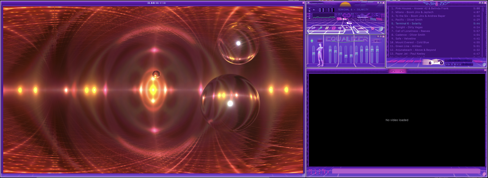

# MacAmp


A native macOS audio player that recreates the classic desktop audio player interface in SwiftUI, pixel for pixel, with full skin compatibility.



## Overview

### Key Features

- **Skins** - Load and hot-swap classic `.wsz` skins (sprites, PLEDIT.txt colors, VISCOLOR.TXT gradients) without a restart; 7 skins are bundled
- **Audio Engine** - Local files and HTTP/HTTPS internet radio through one AVAudioEngine pipeline, with live stream metadata and automatic reconnect after network drops
- **10-Band Equalizer** - Preamp, 17 built-in presets and EQF preset files; applies to local files, streams and video
- **Visualizers** - Spectrum analyzer and oscilloscope in the main window (click to cycle Spectrum → Oscilloscope → None), plus a Milkdrop window with 245 Butterchurn presets
- **Video** - MP4, MOV and M4V playback in a skinnable, resizable video window; EQ, balance and the visualizers apply to the video's audio
- **Playlist** - Resizable window with sprite-based ADD, REM, MISC and LIST menus, multi-select, and M3U/M3U8 load and save
- **Five Windows** - Main, Equalizer, Playlist, Video and Milkdrop, with magnetic docking, windowshade strips, double size (Ctrl+D), always on top (Ctrl+A) and whole-player minimize
- **Window State** - Positions, open/closed state and shade persist across launches; windows return on screen after sleep/wake and display changes
- **Playback Controls** - Volume, balance, seeking, shuffle and three-state repeat (Off/All/One, Ctrl+R)
- **macOS Integration** - Now Playing in Control Center; play/pause/next/previous from media keys, Bluetooth headphones and Control Center
- **Accessibility** - Keyboard navigation and VoiceOver announcements in the playlist menus

## Requirements

- **macOS 27.0 or later.** On macOS 15 or 26, use [v1.3](https://github.com/hfyeomans/MacAmp/releases/tag/v1.3), the last release that supports them.
- **Xcode 27** (macOS 27 SDK) and XcodeGen to build from source

## Download

### Latest Release: v2.0 (September 2026)

[](https://github.com/hfyeomans/MacAmp/releases/tag/v2.0)

**[Download MacAmp-2.0.dmg](https://github.com/hfyeomans/MacAmp/releases/download/v2.0/MacAmp-2.0.dmg)**

| Property | Value |
|----------|-------|
| Version | 2.0 |
| Build | 14 |
| Minimum macOS | 27.0 |
| Signed | Developer ID Application |
| Notarized | Yes (Apple approved) |
| Architecture | Apple Silicon (arm64) |

**Installation:**
1. Download the DMG file
2. Open the DMG
3. Drag MacAmp to Applications folder
4. Launch from Applications (no Gatekeeper warnings)

**What's New in v2.0:**
- **Requires macOS 27** - macOS 15 and 26 stay on v1.3.
- **EQ, balance and visualizers for video** - The 10-band EQ, preamp, balance, spectrum/oscilloscope and Milkdrop now work on video audio.
- **Window docking and layout** - The docked group moves with Main, Shift-drag moves Main alone, window state persists, and windows recover after sleep/wake or display changes (Options › Reset Window Positions as a fallback).
- **Minimize and windowshade** - Cmd+M or Option+M minimizes the whole player; Ctrl+W toggles Main's windowshade. Shade strips for Main, EQ and Playlist now work and can be dragged.
- **Fixes** - Accurate EQ band frequencies, no visualizer freeze while dragging sliders, and instant pause on internet radio.

See [v2.0 in Version History](#v20-september-2026---video-dsp-window-management--macos-27) and the [Release Notes](https://github.com/hfyeomans/MacAmp/releases/tag/v2.0).

## Installation

### Building from Source

```bash
# Clone the repository
git clone https://github.com/hfyeomans/MacAmp.git
cd MacAmp

# Generate Xcode project (required — .xcodeproj is not committed)
brew install xcodegen  # if not installed
xcodegen generate

# Open in Xcode and build (Cmd+R)
open MacAmpApp.xcodeproj
```

## Usage

### Main Window

**Playback Controls:**
- **Load Files** - Eject button or Cmd+O
- **Transport** - Play/Pause/Stop, Previous/Next track buttons
- **Seek** - Drag position slider to jump to any point
- **Volume/Balance** - Sliders for volume and stereo balance

**Clutter Bar** (vertical strip, left side):
| Button | Shortcut | Function |
|--------|----------|----------|
| **O** | Ctrl+O | Options menu (time display, double-size, repeat, shuffle) |
| **A** | Ctrl+A | Always On Top toggle |
| **I** | Ctrl+I | Track Information dialog |
| **D** | Ctrl+D | Double Size mode (100%/200%) |
| **V** | Ctrl+V | Video Window toggle |

**Visualizer** - Click to cycle: Spectrum Analyzer → Oscilloscope → None

**Repeat Modes** (Ctrl+R to cycle):
- **Off** - Stops at playlist end
- **All** - Loops entire playlist
- **One** - Repeats current track (shows "1" badge)

**Windowshade** - Ctrl+W or Cmd+Option+1 collapses Main to a 14px strip with transport and eject buttons, a position slider, mini time display and mini visualizer.

**Minimize** - The titlebar minimize button, Cmd+M or Option+M minimizes the whole player to a single Dock tile. Restoring it brings back the windows that were open.

### Docking and Window Layout

- Windows snap to each other and to screen edges within 10px.
- Dragging Main moves every window docked to it, including closed ones, so a closed EQ still links Main to the Playlist below it.
- Hold Shift when you start dragging Main to move it alone, without snapping.
- Shade, double size and resizing move the attached windows along with the window that changed size.
- **Options › Reset Window Positions** restores the default stack.

### Equalizer Window

Open with **Cmd+Shift+3** or click the EQ button.

- **10 Frequency Bands** - Drag sliders to adjust (70Hz to 16kHz)
- **Preamp** - Overall gain control
- **ON/OFF** - Toggle EQ processing for local files, internet radio and video
- **Presets** - 17 built-in presets (Classical, Rock, Dance, etc.) via Presets button
- **Windowshade** - Cmd+Option+3; the strip has volume and balance sliders

### Playlist Window

Open with **Cmd+Shift+2** or click the PL button.

**Sprite-Based Menus:**
- **ADD** - Add local files, directories, or URLs (internet radio)
- **REM** - Remove selected, crop to selection, clear playlist
- **MISC** - Sort options, file info
- **LIST OPTS** - New, load and save playlists (M3U/M3U8)

**Features:**
- **Double-click** to play any track
- **Multi-select** - Shift+Click to add or remove tracks, Cmd+A for all
- **Resize** - Drag bottom-right corner (25×29px segments, min 275×116)
- **Scroll Slider** - Gold thumb on right border
- **Mini Visualizer** - Appears when Main is closed (≥350px width)
- **Windowshade** - Cmd+Option+2; the strip shows the current title and track length and has a width grip

**Note:** Internet streams show "Connecting..." while buffering, then live metadata. Streams reconnect automatically after network interruptions.

### Video Window

Open with **Ctrl+V** or click the V clutter button.

- **Supported Formats** - MP4, MOV, M4V, AVI (limited codecs)
- **Resize** - Drag corner (25×29px segments) or use 1x/2x preset buttons
- **Controls** - Volume, seek, and time display sync with main window
- **Audio** - EQ, preamp, balance and all visualizers apply to the video's audio. Multichannel audio is downmixed to stereo; AirPlay and external audio devices follow the system output route.
- **Metadata Ticker** - Scrolling filename, codec, and resolution
- **Skinnable** - VIDEO.bmp chrome or classic fallback

### Milkdrop Window

Open with **Ctrl+K** for 245 Milkdrop 2 presets at 60 FPS, driven by local files, internet radio or video audio.

**Context Menu (Right-click):**
- Current preset display
- Next/Previous preset (Space/Backspace)
- Randomize (R) and Auto-Cycle (C) toggles
- Cycle Interval submenu (5s/10s/15s/30s/60s)
- Show Track Title (T) and Track Title Interval submenu
- Preset list (245 presets, first 100 shown)

**Window:** Resizable (25×29px segments), magnetic docking, GEN.bmp skinnable chrome.

### Skins

**Bundled Skins** (Skins menu): Classic Winamp, Internet Archive, Tron Vaporwave, Winamp3 Classified, KenWood KDC-7000 Elite, Mac OS X, Sony MP3 Player.

**Skins Menu:**
- **Cmd+Shift+O** - Import Skin File
- **Cmd+Shift+L** - Open Skins Folder
- **Cmd+Shift+R** - Refresh Skins

**Import Skins:** Place `.wsz` files in `~/Library/Application Support/MacAmp/Skins/`

## Architecture

MacAmp uses a strict three-layer separation, inspired by web frameworks but adapted for SwiftUI's declarative paradigm.

### Mechanism Layer ("What the app does")
- **PlaybackCoordinator** - Orchestrates playback across local files, streams and video
- **AudioPlayer** - Playback facade with AudioEngineController for engine lifecycle and 10-band EQ
- **StreamPlayer** - Internet radio with custom decode pipeline and auto-reconnect
- **VideoPlaybackController** - Video AVPlayer lifecycle management
- **Video DSP tap** (`Audio/VideoDSP/`) - In-place `MTAudioProcessingTap` on AVPlayer that applies EQ, preamp and balance and feeds the visualizers
- **VisualizerPipeline** - Engine audio tap, spectrum/waveform processing, Butterchurn data
- **PlaylistController** - Playlist state and navigation logic
- **EQPresetStore** - Preset persistence (UserDefaults + JSON)
- **SkinManager** - Skin loading and hot-swapping

### Bridge Layer ("How components connect")
- **SpriteResolver** - Semantic sprite resolution for cross-skin compatibility
- **WindowCoordinator** - 5-window lifecycle and AppKit/SwiftUI bridge
- **DockGraph** / **WindowSnapManager** - Docked-group computation, magnetic snapping and group moves
- **WindowScreenGuard** - Off-screen recovery after sleep/wake and display changes
- **WindowFocusState** - Unified focus tracking across all windows

### Presentation Layer ("What the user sees")
- **SwiftUI Views** - Pixel-perfect sprite rendering (`.interpolation(.none)`)
- **SimpleSpriteImage** - Interactive sprite components with semantic IDs
- **SkinHitButton** - Titlebar and shade-strip buttons drawn by the skin bitmap
- **Window Chrome Views** - Skinnable VIDEO.bmp and GEN.bmp chrome

For detailed architecture documentation, see [`docs/MACAMP_ARCHITECTURE_GUIDE.md`](docs/MACAMP_ARCHITECTURE_GUIDE.md).

## Project Structure

```
MacAmpApp/
├── Audio/            # Mechanism: AVAudioEngine playback, EQ, visualizer pipeline,
│   ├── Streaming/    #   internet radio decode (ICY, AudioFileStream, AudioConverter)
│   └── VideoDSP/     #   AVPlayer audio tap (EQ biquads, balance, visualizer feed)
├── Models/           # @Observable settings, parsers (M3U, PLEDIT, VISCOLOR, EQF),
│                     #   sprite resolution, docking geometry (DockGraph, ScreenClamp)
├── ViewModels/       # Bridge: WindowCoordinator, SkinManager, Butterchurn bridge/presets
├── Windows/          # AppKit window controllers, frame persistence, visibility, screen guard
├── Views/            # Presentation: SwiftUI views (MainWindow/, PlaylistWindow/,
│                     #   Components/, Shared/, Windows/)
├── Utilities/        # Logging, window snapping and delegates, helpers
├── Skins/            # Bundled .wsz skins
├── AppCommands.swift     # Options menu commands and keyboard shortcuts
├── SkinsCommands.swift   # Skins menu
└── MacAmpApp.swift       # App entry point and dependency injection

Butterchurn/          # Butterchurn engine and preset packs (JS)
Tests/MacAmpTests/    # Swift Testing suites (137 tests)
docs/                 # Technical documentation
tasks/                # Development planning and context
project.yml           # XcodeGen project definition
```

## Keyboard Shortcuts

### Global Controls

| Shortcut | Action |
|----------|--------|
| `Cmd+O` | Open files |
| `Ctrl+O` | Open options menu (time, double-size, repeat, shuffle) |
| `Ctrl+T` | Toggle time display (elapsed ⇄ remaining) |
| `Ctrl+R` | Cycle repeat mode (Off → All → One) |
| `Ctrl+I` | Show track information dialog |
| `Ctrl+D` | Toggle double-size mode (100% ↔ 200%) |
| `Ctrl+A` | Toggle always on top |
| `Ctrl+V` | Toggle video window |
| `Ctrl+K` | Toggle Milkdrop window |
| `Ctrl+W` | Toggle Main windowshade |
| `Cmd+M` / `Option+M` | Minimize the player (from any MacAmp window) |
| `Cmd+Shift+1` / `2` / `3` | Show/hide Main / Playlist / Equalizer |
| `Cmd+Option+1` / `2` / `3` | Shade/unshade Main / Playlist / Equalizer |
| `Cmd+Shift+O` / `L` / `R` | Import skin / Open skins folder / Refresh skins |
| `Cmd+,` | Preferences |
| `Shift` + drag Main | Move Main alone, without snapping |

### Menu Navigation & Accelerators

| Key | Action |
|-----|--------|
| `↑` / `↓` | Navigate menu items (when menu is open) |
| `Escape` | Close menu |
| `Click` | Activate highlighted item |
| `Ctrl+D` | Double-size (when Options menu is open) |
| `Ctrl+R` | Repeat (when Options menu is open) |
| `Ctrl+S` | Shuffle (when Options menu is open) |

**Accessible Menus:** ADD, REM, MISC, and LIST support keyboard navigation with VoiceOver announcements.

## Supported Formats

### Audio Files
- MP3 (all bitrates)
- FLAC (lossless)
- AAC/M4A
- WAV/AIFF
- Apple Lossless (ALAC)

### Video Files
- MP4 (H.264, HEVC)
- MOV (QuickTime)
- M4V (iTunes video)
- AVI (limited codecs)

### Playlists & Streams
- M3U/M3U8 (local files + radio URLs)
- HTTP/HTTPS streams (SHOUTcast, Icecast)

### Skins
- WSZ (ZIP-based Winamp skins)
- Missing sprite sheets fall back to the bundled default skin

## Technical Highlights

### Modern macOS Features

- **Five-Window Architecture** - AppKit window controllers hosting SwiftUI views, with unified focus state
- **@Observable Macro** - Swift 6 strict concurrency with @MainActor isolation
- **Unified Audio Pipeline** - Local files and streams through AVAudioEngine, with EQ, visualizer and balance for both
- **AVPlayer-Native Video DSP** - An in-place `MTAudioProcessingTap` runs a biquad EQ cascade matched to AVAudioUnitEQ, preamp and balance on video audio, and feeds the same visualizer path
- **10-Band EQ** - Real-time equalization via AVAudioUnitEQ
- **Hot Skin Swapping** - Runtime skin changes without app restart

### Skin Compatibility

MacAmp implements comprehensive skin support:

- **Sprite Resolution** - Handles `DIGIT_0` vs `DIGIT_0_EX` variants automatically
- **Dynamic Loading** - Loads sprite sheets from ZIP archives on-the-fly
- **Fallback System** - Uses default-skin sprites (or transparent placeholders) for missing sheets
- **2D Grid Rendering** - Supports complex sprite layouts (e.g., EQMAIN.BMP 14×2 grid)
- **Mirrored Gradients** - Balance slider with proper center snapping

See [`docs/SPRITE_SYSTEM_COMPLETE.md`](docs/SPRITE_SYSTEM_COMPLETE.md) for implementation details.

### Performance Optimizations

- **Pre-allocated Visualizer Buffers** - Zero allocations on the realtime audio thread (VisualizerScratchBuffers)
- **Goertzel Algorithm** - Efficient single-bin DFT for 20-bar spectrum analysis
- **vDSP Acceleration** - Hardware-accelerated audio processing via Accelerate framework
- **Sprite Sheet Caching** - Pre-processed backgrounds for instant rendering
- **Progress Timer** - 100ms update interval balances CPU vs. smoothness

## Version History

### v2.0 (September 2026) - Video DSP, Window Management & macOS 27

**Features:**
- **Requires macOS 27.0 or later** - macOS 15 and 26 stay on v1.3.
- **EQ, Balance and Visualizers for Video** - The 10-band EQ, preamp, balance, spectrum analyzer, oscilloscope and Milkdrop now apply to video audio. Video audio stays on AVPlayer and is processed in place, so AirPlay and external audio devices follow the system output route. 5.1 and other multichannel tracks are downmixed to stereo.
- **Window Docking** - Dragging Main moves its whole docked group, including closed windows, so a closed EQ still links Main to the Playlist. Windows snap within 10px to the nearest edge. Hold Shift when you start dragging to move Main alone. Double size and shade keep docked windows attached.
- **Window State Persistence** - EQ and Playlist open/closed and shade state are restored at launch.
- **Off-Screen Recovery** - Windows come back on screen after sleep/wake and when displays are added or removed. New **Options › Reset Window Positions**.
- **Group Minimize** - Main's minimize button, Cmd+M or Option+M (from any MacAmp window) minimizes the whole player to one Dock tile. The EQ and Playlist minimize buttons were removed.
- **Windowshade** - Ctrl+W toggles Main's windowshade. Titlebars and shade strips now use each skin's own buttons, and every strip can be dragged:
  - Main: transport and eject, position slider, mini time and mini visualizer
  - EQ: volume and balance sliders
  - Playlist: current title, track length and a width grip

**Bugs Fixed:**
- The first three EQ bands now process at 70, 180 and 320 Hz, the original player's internal frequencies, instead of the 60, 170 and 310 Hz printed on skins
- Spectrum analyzer no longer freezes while dragging the volume or balance slider
- Milkdrop preset auto-cycle and track-title overlay keep running while a slider is dragged
- Pausing internet radio is instant (about 0.7s of audio used to play on); a stream that drops while paused no longer reconnects by itself, and a long-paused stream resumes at the live edge
- Changing the audio output during video playback no longer resumes the previous track or drops a pause
- Video and Milkdrop windows no longer reopen higher than where they were closed

**Technical:**
- Swift 6.2 with strict concurrency
- 137 automated tests, Thread Sanitizer clean
- Developer ID signed and Apple notarized

---

### v1.3 (March 2026) - Now Playing, LIST OPTS & Stream Timer

**Features:**
- **Now Playing + Remote Commands** - macOS Control Center shows current track with artwork, title, artist, duration. Play/pause/next/previous from keyboard media keys, Bluetooth headphones, and Control Center widget.
- **Playlist LIST Operations** - NEW LIST, LOAD LIST, SAVE LIST buttons in playlist window. M3U/M3U8 import and export with background I/O and generation-token safety.
- **Stream Elapsed Timer + Playlist Position** - Live elapsed time counter for internet radio streams (anchor-based, not polling). Playlist shows track position (e.g., "3/15"). Auto-play consolidation through PlaybackCoordinator.

**Bugs Fixed:**
- Skin digit black rectangles on non-black skins
- Time display hit area and digit positioning
- Playlist color defaults (green vs white for missing pledit.txt)
- Viscolor fallback regression
- NUMS_EX extended digit sprite support
- File size overflow on skin import (int32 → int64)
- Import error semantic precision
- loadAudioFile crash guard
- Case-insensitive stream URL schemes
- M3U import safety fixes
- Now Playing lifecycle cleanup

**Technical:**
- Swift 6.2 with strict concurrency
- 55 automated tests
- Developer ID signed and Apple notarized

---

### v1.2 (March 2026) - Unified Audio Pipeline & Stream Reliability

**Major Features:**
- **Unified Audio Pipeline** - EQ, spectrum analyzer, oscilloscope, and balance now work for internet radio streams — full feature parity with local file playback
- **Auto-Reconnect** - Internet radio streams automatically reconnect after network interruptions with exponential backoff (up to 10 attempts)
- **Stream Error Display** - Clear, user-friendly error messages replace the generic "buffer 0%" indicator
- **Stream Display** - Station name and track title shown together (e.g., "80s80s - Never Gonna Give You Up")

**Improvements:**
- **EQ Persistence** - Equalizer on/off state now persists across app restarts
- **VBR Seek Accuracy** - Improved seek bar and time label accuracy for variable bitrate MP3 and AAC files
- **Butterchurn Reliability** - MilkDrop visualizations load reliably in all build configurations

**Technical:**
- Swift 6.2 with strict concurrency
- 53 automated tests
- Developer ID signed and Apple notarized

---

### v1.0.6 (February 2026) - Balance Slider Fix & Persistence

**Bug Fixes & Improvements:**
- **Balance Slider Color Gradient** - Fixed the balance slider to properly display left/right stereo panning with correct color gradient
- **Volume/Balance Persistence** - Volume and balance slider values now persist across app restarts via UserDefaults
- Developer ID signed and Apple notarized

---

### v1.0.5 (January 2026) - Code Quality & Architecture

**Major Changes:**
- **Force Unwrap Elimination** - Removed force unwraps across the playback pipeline to prevent crashes on unexpected nil values
- **AudioPlayer Decomposition** - AudioPlayer reduced from about 1,800 to 1,043 lines by extracting EQPresetStore, MetadataLoader, PlaylistController, VideoPlaybackController and VisualizerPipeline
- **SwiftLint Integration** - Automated linting for all Swift files

**Technical:**
- Thread Sanitizer clean with @MainActor annotations
- Developer ID signed and Apple notarized

---

### v1.0.1 (January 2026) - First Stable Release

The first stable release of MacAmp, shipping the resizable Milkdrop window and 245 Butterchurn presets introduced in v0.10.0.

**Technical:**
- Developer ID signed and Apple notarized

### v0.10.0 (January 2026) - Butterchurn Visualizations + Milkdrop Resize

**Major Features:**
- **Butterchurn Visualization Engine** - Milkdrop 2 visualizations via WebGL
  - 245 presets from Milkdrop 2 library (expanded from original 29)
  - 60 FPS audio-reactive rendering with real-time FFT from AVAudioEngine
  - WKUserScript injection for butterchurn.min.js and butterchurnPresets.min.js
  - 30 FPS Swift→JS audio bridge via callAsyncJavaScript
- **Preset Management System** - Full Winamp-compatible preset controls
  - Space/Backspace for next/previous (history-based navigation)
  - R key toggles randomize mode
  - C key toggles auto-cycle with intervals (5s/10s/15s/30s/60s)
  - T key shows track title overlay with configurable intervals
  - Context menu with direct preset selection (up to 100 shown)
  - Preset state persisted across restarts (randomize, cycle, intervals)
- **Milkdrop Window Resize** - Segment-based resizing with dynamic chrome
  - Drag bottom-right corner with 25×29px quantized segments
  - Minimum 275×116px (Size2D[0,0]), default 275×232px (Size2D[0,4])
  - Dynamic titlebar expansion using gold filler tiles (symmetrical left/right)
  - 7-section titlebar layout: LEFT_CAP + LEFT_GOLD(n) + LEFT_END + CENTER(3) + RIGHT_END + RIGHT_GOLD(n) + RIGHT_CAP
  - MilkdropWindowSizeState @Observable with computed layout properties
  - Size persistence via UserDefaults
  - Butterchurn canvas sync on resize via ButterchurnBridge.setSize()
- **GEN.bmp Sprite System** - Complete chrome implementation
  - MILKDROP HD titlebar letterforms (two-piece sprites for selected/inactive)
  - Active/Inactive titlebar states with WindowFocusState integration
  - Two-piece bottom bar sprites (TOP + BOTTOM for pixel-perfect alignment)

**Technical Achievements:**
- WKWebView integration with WebGL for visualization
- ButterchurnPresetManager with cycling, randomization, and history
- NSMenu closure-to-selector bridge pattern (MilkdropMenuTarget)
- AppKit resize preview overlay during drag (WindowResizePreviewOverlay)
- Thread Sanitizer clean (Timer cleanup, @MainActor annotations)

**Implementation:**
- PR #36: Milkdrop window foundation with GEN.bmp chrome
- PR #37: Butterchurn.js visualization integration
- PR #38: Preset library expansion (29→245 presets)
- PR #39: Window resize with dynamic titlebar system

### v0.9.1 (December 2025) - Playlist Window Resize + Mini Visualizer

**Major Features:**
- **Playlist Window Resize** - Full resize support matching Winamp behavior
  - Drag bottom-right corner to resize in 25×29px quantized segments
  - Minimum 275×116px, maximum 2000×900px
  - Three-section bottom bar: LEFT (125px menus) + CENTER (dynamic tiles) + RIGHT (150px controls)
  - Dynamic top bar and side border tiling
  - Size persisted to UserDefaults across restarts
- **Playlist Scroll Slider** - Functional gold thumb scroll control
  - Proportional thumb size based on visible/total tracks
  - Drag to scroll through playlist
  - Located in right border area
- **Playlist Mini Visualizer** - Spectrum analyzer in playlist window
  - Activates when main window is **shaded** (minimized to 14px bar)
  - Requires playlist width ≥350px (3+ width segments)
  - Same 19-bar spectrum analyzer as main window
  - Renders 76px, clips to 72px (Winamp historical accuracy)

**Main Window Shade Mode:**
- Shade state migrated to AppSettings (observable, persisted)
- Cross-window observation enables playlist visualizer activation
- Menu command "Shade/Unshade Main" fixed

**Bug Fixes:**
- Fixed shade mode buttons not clickable (ZStack alignment)
- Fixed NSWindow constraints (allow dynamic playlist width)
- Fixed persisted size restoration on launch
- Fixed PLAYLIST_BOTTOM_RIGHT_CORNER sprite width (154→150px)

**Architecture:**
- PlaylistWindowSizeState.swift - Observable state with computed layout properties
- PlaylistScrollSlider.swift - Reusable scroll slider component
- Three-layer pattern maintained (Mechanism→Bridge→Presentation)

### v0.8.9 (November 2025) - Video & Milkdrop Windows

**Major Features:**
- **Video Window** - Native video playback with VIDEO.bmp skinned chrome
  - Full resize with 25×29px quantized segments
  - 1x/2x size preset buttons
  - VIDEO.bmp sprite rendering (24 sprites) or classic fallback
  - Metadata ticker with auto-scrolling (filename, codec, resolution)
- **Milkdrop Window Foundation** - GEN.bmp two-piece letter sprites
  - "MILKDROP" titlebar with 32 letter sprites
  - Active/Inactive focus states
  - Foundation ready for future visualization
- **Unified Video Controls**
  - Volume slider synced to video playback
  - Seek bar works for video files (drag to any position)
  - Time display shows video elapsed/remaining
  - Clean switch between audio↔video playback

**5-Window Architecture:**
- Main, Equalizer, Playlist, VIDEO, and Milkdrop windows
- Magnetic docking for all windows
- Window focus tracking with active/inactive sprites
- Position persistence via WindowFrameStore
- V button (Ctrl+V) and K button (Ctrl+K) shortcuts

**Technical Achievements:**
- Size2D quantized resize model (25×29px segments)
- WindowCoordinator bridge methods for AppKit/SwiftUI separation
- Observable visibility state (isEQWindowVisible, isPlaylistWindowVisible)
- Task { @MainActor in } pattern for timer/observer closures
- playbackProgress stored pattern (must assign all three values)
- currentSeekID invalidation before playerNode.stop()
- AppKit preview overlay for resize visualization

**Bug Fixes:**
- Fixed invisible window phantom affecting cluster docking
- Fixed titlebar gap with proper tile calculation (ceil())
- Fixed EQ/PL button state sync with WindowCoordinator
- Fixed timer closures using proper MainActor hopping

### v0.7.8 (November 2025) - Clutter Bar O & I Buttons

**New Features:**
- **O Button (Options Menu)** - Context menu with player settings
  - Time display toggle (elapsed ⇄ remaining)
  - Quick access to double-size, repeat, and shuffle modes
  - Keyboard shortcuts: Ctrl+O (menu), Ctrl+T (time toggle)
- **I Button (Track Information)** - Metadata dialog
  - Shows track title, artist, duration
  - Technical details: bitrate, sample rate, channels
  - Stream-aware with graceful fallbacks
  - Keyboard shortcut: Ctrl+I
- **Time Display Enhancement** - Click time display to toggle, persists across restarts

**Bug Fixes:**
- Fixed NSMenu lifecycle issue preventing repeated menu usage
- Fixed minus sign vertical centering in time display
- Fixed keyboard shortcuts working with any window focused
- Fixed SwiftUI state mutation warning

**Clutter Bar Status:** 5 of 5 buttons functional (O, A, I, D, V)

### v0.2.0 (October 2025) - Swift 6 Modernization

**Major Architecture Upgrade:**
- **Swift 6.0** - Upgraded to Swift 6 with strict concurrency
- **Modern State Management** - Migrated to @Observable framework for better performance
- **Keyboard Accessibility** - Full keyboard navigation in playlist menus
- **Zero Warnings** - Clean build with strict concurrency checking
- **Improved Performance** - 10-20% fewer UI updates with fine-grained observation
- **VoiceOver Support** - Screen reader accessibility for menus

**User-Visible Improvements:**
- Arrow key navigation in all playlist menus (ADD, REM, MISC, LIST)
- Pixel-perfect sprite rendering throughout
- Improved audio playback reliability

---

## Development

### Known Limitations

- **Skin Sprite Coverage** - Some rare skin variants may have missing sprites (fallbacks generated)
- **Enter Key in Menus** - Menu activation requires click (arrow key navigation + click works)
- **Multichannel Video Audio** - 5.1+ video is downmixed to stereo ([#88](https://github.com/hfyeomans/MacAmp/issues/88))
- **Multi-Room Sync** - AirPlay 2 multi-room audio not yet supported

### Contributing

Contributions are welcome. High-impact areas (planning notes in [`tasks/`](tasks/)):

1. **Playlist Drag & Drop** - Drop files directly into the playlist window
2. **HLS Streaming** - Add HLS protocol support to stream decode pipeline
3. **OGG Vorbis** - Local files and Icecast streams
4. **Multichannel Video Output** - 5.1+ output with speaker-side balance ([#88](https://github.com/hfyeomans/MacAmp/issues/88))
5. **Dock Integration** - Show transport controls in macOS dock menu

## Documentation

**Complete Documentation Index:** [`docs/README.md`](docs/README.md)

### Architecture & Design

| Document | Description |
|----------|-------------|
| [`MACAMP_ARCHITECTURE_GUIDE.md`](docs/MACAMP_ARCHITECTURE_GUIDE.md) | **Primary Reference** - Complete system architecture, three-layer design, unified audio pipeline, video DSP |
| [`IMPLEMENTATION_PATTERNS.md`](docs/IMPLEMENTATION_PATTERNS.md) | Code patterns, @Observable usage, testing, anti-patterns |
| [`SPRITE_SYSTEM_COMPLETE.md`](docs/SPRITE_SYSTEM_COMPLETE.md) | Semantic sprite resolution, skin file structure |
| [`WINAMP_SKIN_VARIATIONS.md`](docs/WINAMP_SKIN_VARIATIONS.md) | Skin format specifications, file structure |

### Window Documentation

| Document | Description |
|----------|-------------|
| [`MULTI_WINDOW_ARCHITECTURE.md`](docs/MULTI_WINDOW_ARCHITECTURE.md) | 5-window system, docking, off-screen recovery, minimize, windowshade |
| [`WINDOW_FOCUS_ARCHITECTURE.md`](docs/WINDOW_FOCUS_ARCHITECTURE.md) | Active/inactive focus tracking across windows |
| [`PLAYLIST_WINDOW.md`](docs/PLAYLIST_WINDOW.md) | Playlist resize, scroll slider, mini visualizer |
| [`VIDEO_WINDOW.md`](docs/VIDEO_WINDOW.md) | Video playback, VIDEO.bmp chrome, seek/volume sync, video audio DSP |
| [`MILKDROP_WINDOW.md`](docs/MILKDROP_WINDOW.md) | Butterchurn visualization, GEN.bmp sprites, preset management |

### Build & Distribution

| Document | Description |
|----------|-------------|
| [`RELEASE_BUILD_GUIDE.md`](docs/RELEASE_BUILD_GUIDE.md) | Building, signing, notarizing, DMG creation |

## Credits

### Inspiration

MacAmp draws inspiration from the classic desktop audio player that defined a generation of music listening, adapted for modern macOS with native SwiftUI.

### Dependencies

**Third-party:**
- [ZIPFoundation](https://github.com/weichsel/ZIPFoundation) - WSZ skin archive extraction
- [Butterchurn](https://github.com/jberg/butterchurn) - Milkdrop 2 WebGL visualizations

**Apple Frameworks:**
- **AVFoundation** - AVAudioEngine, AVPlayer, 10-band EQ, audio/video playback
- **MediaToolbox** - `MTAudioProcessingTap` for video audio processing
- **SwiftUI** - Declarative UI with @Observable state management
- **AppKit** - NSWindow, NSMenu, NSWindowController for window chrome
- **Accelerate** - vDSP hardware-accelerated FFT for spectrum analysis
- **WebKit** - WKWebView for Butterchurn visualization rendering

### References

- **Webamp** - Browser-based implementation for architectural patterns
- **Skin Format Specification** - Classic skin `.wsz` format documentation
- **Apple Documentation** - SwiftUI and Swift 6.2 for macOS 27+

## License

MIT License - see [LICENSE](LICENSE) for details.

## Support

For issues, questions, or feature requests:
- Open an [issue on GitHub](https://github.com/hfyeomans/MacAmp/issues)
- Check [`docs/`](docs/) for technical documentation
- Review [`tasks/`](tasks/) for development planning
